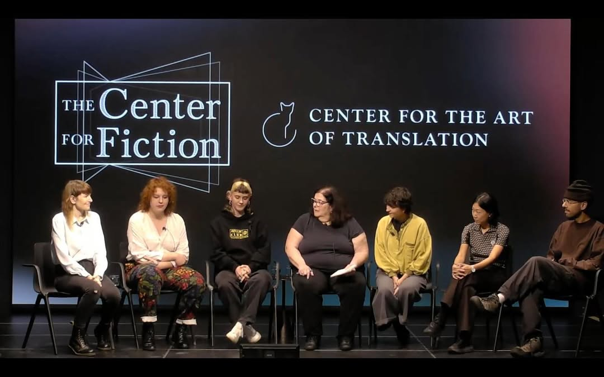

**Sep 26, 2024**\
**Brooklyn, NY**

Invited to speak about Afghan design and Farsi typography in Brooklyn at the [Day of Translation](https://www.youtube.com/live/aCglHCuxTLQ) organized by the [Center for Fiction](https://centerforfiction.org/event/2024-day-of-translation/) and the [Center for the Art of Translation](https://www.catranslation.org/event/day-of-translation-2024/).

[^1]This panel explores intersections between the arts of typography and translation. Bringing together typographers, educators, artists, and translators working with different scripts, we will discuss how interventions in typography can be used to address issues in translation such as accessibility, gendered binaries, language preservation and revival, and colonial histories.

[^1]: https://centerforfiction.org/event/2024-day-of-translation/