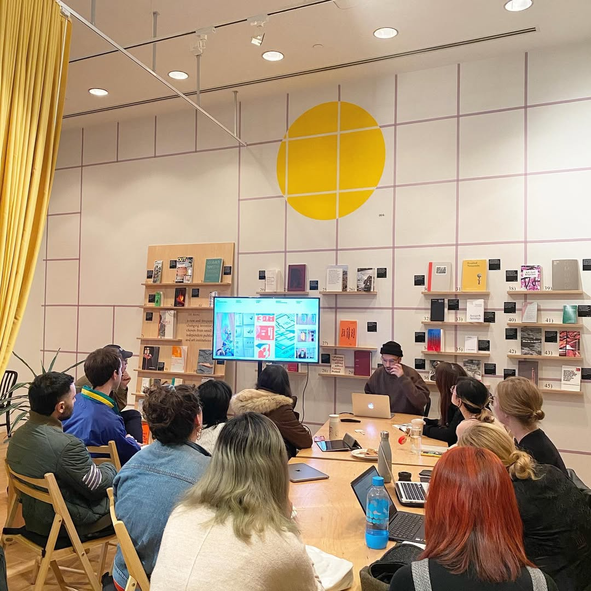

**Feb 19, 2020**\
**San Francisco, CA**

Gave a talk to CCA MFA students at the [Curatorial Research Bureau](https://www.curatorialresearchbureau.org/) on how to design an exhibition. 

I shared my experience as an in-house graphic designer at SFMOMA and talked about some of the projects I've worked on, including SFMOMA's first contemporary arts exhibition, *Soft Power*.