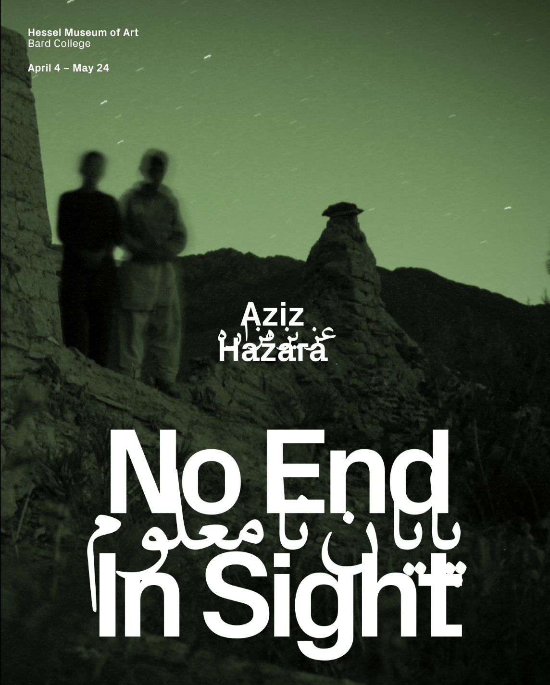

**Aug 20, 2020**\
**Annandale-on-Hudson, NY**

Designed the identity for curator [Muheb Esmat](https://marcaz.org/)'s thesis exhibition [*No End in Sight*](https://ccs.bard.edu/museum/exhibitions/548-no-end-in-sight) at the Hessel Museum of Art.

*No End In Sight* is the first US solo exhibition of [Aziz Hazara](https://www.google.com/search?q=aziz+hazara&oq=aziz+hazara&gs_lcrp=EgZjaHJvbWUqCggAEAAY4wIYgAQyCggAEAAY4wIYgAQyBwgBEC4YgAQyCAgCEAAYFhgeMggIAxAAGBYYHjINCAQQABiGAxiABBiKBTINCAUQABiGAxiABBiKBTINCAYQABiGAxiABBiKBdIBCDEzNjNqMGo3qAIAsAIA&sourceid=chrome&ie=UTF-8), and one of the few exhibitions of its kind to be curated, designed, and shown by a group comprised solely of Afghans. I collaborated with Muheb Esmat, curator and CCS Bard graduate, to design the identity, publication, and exhibition for the show.