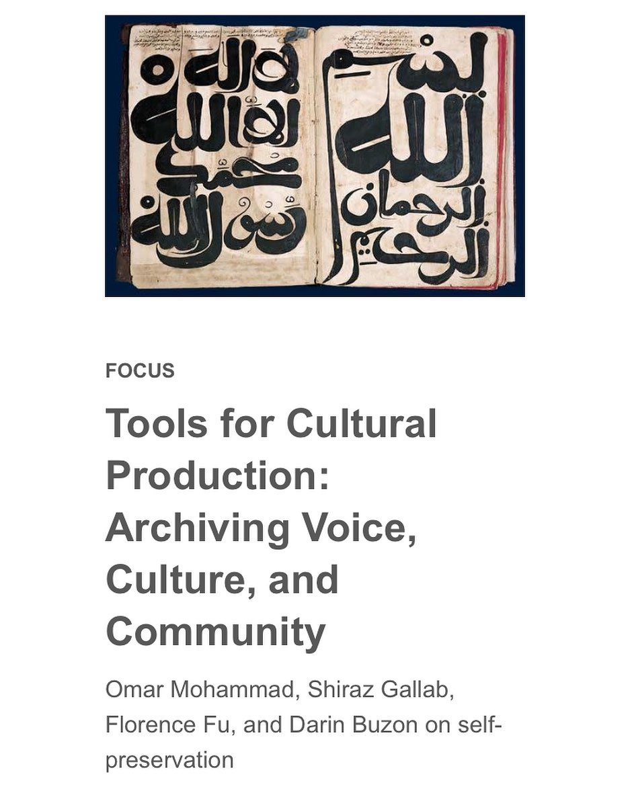

**Dec 09, 2020**\
**The Internet**

Published an essay for the [2021 Are.na annual](https://store.are.na/products/are-na-annual-2021?variant=38246218563735) titled [*Tools for Cultural Production: Archiving Voice, Culture, and Community*.](https://www.are.na/editorial/tools-for-cultural-production-the-practice-of-preserving-voice-culture-and)

Wrote about the importance of creating tools for cultural production within our communities through the forms of archiving and research.