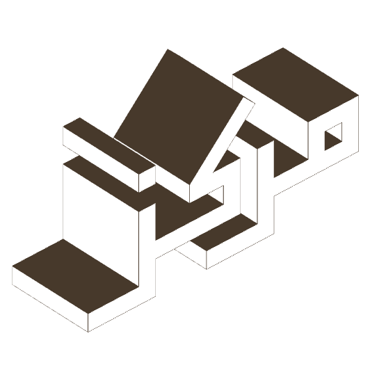

**Jun 08, 2021**\
**Afghanistan**

Designed and programmed [Marcaz](https://marcaz.org/connect), a digital center for Afghan visual and digital cultural research.

A collaboration with curator Muheb Esmat, Marcaz مرکز is an online center that acts as an index of unknown and newly discovered cultural research, history, ideas, and information pertaining to Afghanistan. It is an accessible alternative to physical research, and to digital content that cannot be easily indexed on the internet.