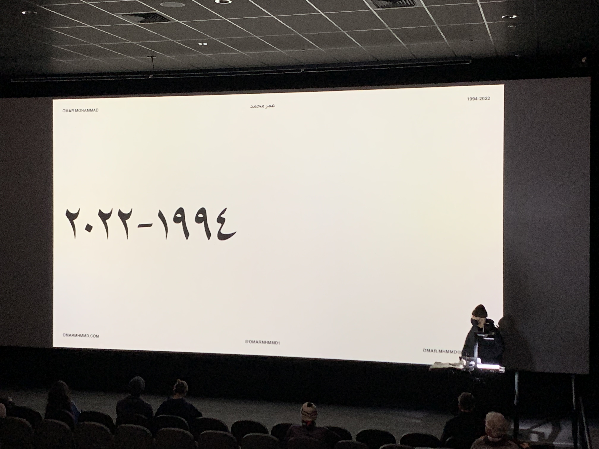

**Feb 17, 2022**\
**Davis, CA**

Invited as a guest lecturer to Dr James Housefield’s Design Aesthetics & Experience course at UC Davis.

I shared a lot of failures, behind-the-scenes, and privileges that enabled me to become the designer I am today. I mostly shared how the Afghan-American experience shaped me as a designer and artist for the best. Thank you to Professor Housefield, and to my friend Jessie Escobar for supporting and for this photo.