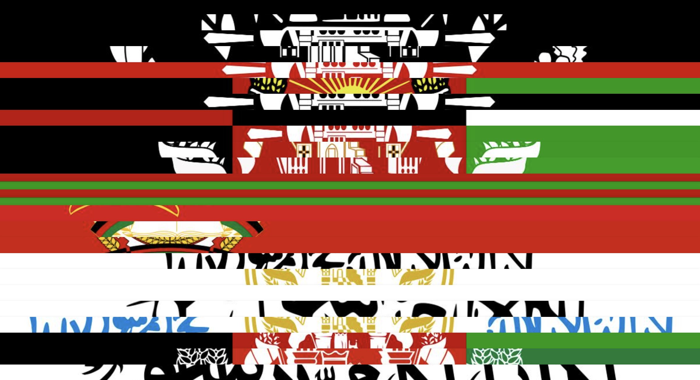

**May 03, 2022**\
**Berkeley, CA**

Published a research website, [Flags Of Afghanistan بيرق هاى افغانستان ](https://foa.omarmhmmd.com/), placing Afghanistan's former flags in political, cultural, and design contexts.

Since the beginning of Afghanistan as a nation state, the design of its flag has existed in a constant state of flux. With each new leader, faction, or party gaining power, the flag and its emblem were altered to represent the new order in the country. [Flags Of Afghanistan](https://foa.omarmhmmd.com/) (FOA) is a study on the cultural and political implications flag design had on Afghanistan since the beginning of the 20th century.[^1]

[^1]:https://foa.omarmhmmd.com/