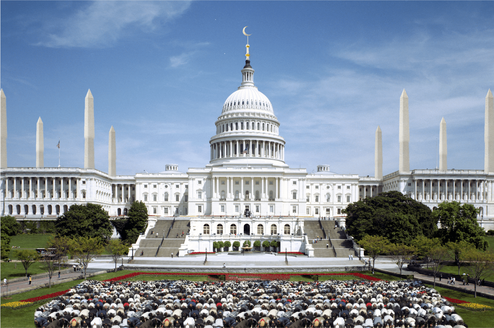

**Mar 31, 2023**\
**Berkeley, CA**

(Re)published an essay on mosque architecture in America: [The American Mosque What, How, and Where to Build](https://theamericanmosque.omarmhmmd.com/).

*The American Mosque* was originally published in 2018 by UC Davis. I was a student in my last year taking an upper division Anthropology course with no prior background in Anthropology whatsoever. My professor secretly submitted my final essay to the university wide [Prized Writing](https://prizedwriting.ucdavis.edu/) competition, and my piece was selected along with 24 other students out of over 400+ submissions.