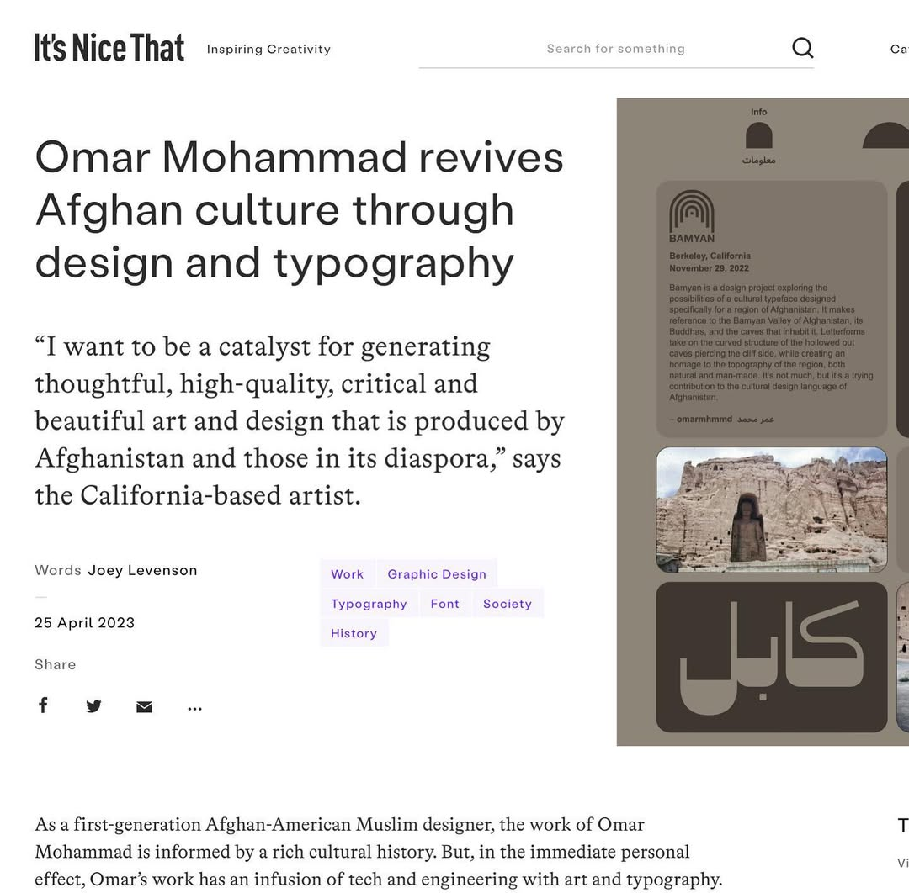

**Apr 25, 2023**\
**Bamyan, Afghanistan**

Featured on itsnicethat: [Omar Mohammad revives Afghan culture through design and typography](https://www.itsnicethat.com/articles/omar-mohammad-bamyan-project-graphic-design-250423).

Omar's work on the Bamyan typeface is a great example of how art and design can revive a culture and bring new ideas and concepts into the conversation. “The typeface is a simple design, yes, but I’m hoping it inspires and encourages designers and artists from Afghanistan to push the limits and boundaries of our work, especially conceptually,” Omar says. “Preserve, produce and share our beautiful culture."[^1]

[^1]: https://www.itsnicethat.com/articles/omar-mohammad-bamyan-project-graphic-design-250423