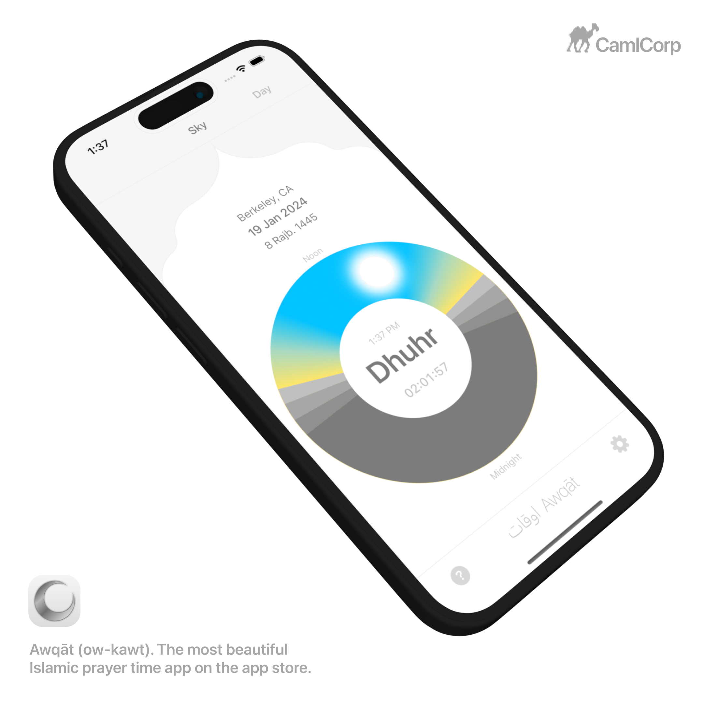

**Jan 30, 2024**\
**Berkeley, CA**

Published the most beautiful [Islamic prayer time app](https://apps.apple.com/us/app/awq%C4%81t/id6461305834) on the app store under [CamlCorp](https://www.c-a-m-l.com/).

اوقات Awqāt (ow-kawt) means “times” in Arabic/Farsi. "Prayer times” in English then translates to اوقات نماز “awqāt namaaz” in Farsi. Awqāt displays Islamic prayer times based on the positions of the sun and the moon using a digital sundial to visualize sunrise, zenith, sunset, and twilight sky positions. Awqāt is the most beautiful Islamic prayer time app on the app store.[^1]

[^1]: https://www.c-a-m-l.com/awqat