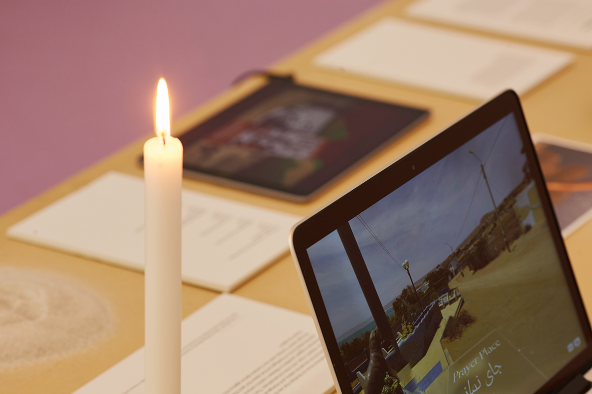

**Nov 11 2024**\
**Vienna, Austria**

Exhibited [jainamaaz](https://jainamaaz.omarmhmmd.com/) in Vienna for [Between Worlds: Technology, Spirit & The Digital South](https://weloveschool.org/performative-screenings/between-worlds).

[^1]*Between Worlds: Technology, Spirit & The Digital South* as a research presentation documents an ongoing investigation by the researcher/curator duo Mekhala Dave & Brooklyn J. Pakathi, exploring how ancestral (Indigenous, communal, spiritual) knowledge systems can fundamentally reshape our understanding and use of modern technology.

[^1]: https://weloveschool.org/performative-screenings/between-worlds