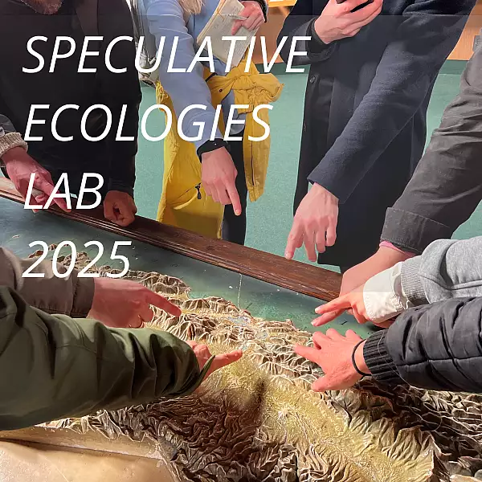

**Apr 04 2025**\
**Berkeley, CA**

Participated in the Speculative Ecologies Lab (SEL), an experimental, week-long initiative led by Berkeley Architecture’s Room One Thousand 2025 fellows.

Over the course of a week, fellows Amy Franceschini of [Future Farmers](https://www.futurefarmers.com/) and Andy Merrit of [Something & Son](https://www.somethingandson.com/) were joined by seven UC Berkeley students for a speculative creative project engaging the diverse ecologies of the Bay Area. Through immersive field inquiry across the North Bay and East Bay, they explored new ways of knowing, collecting, and interpreting place—experimenting with how field research might take shape beyond traditional methods.
