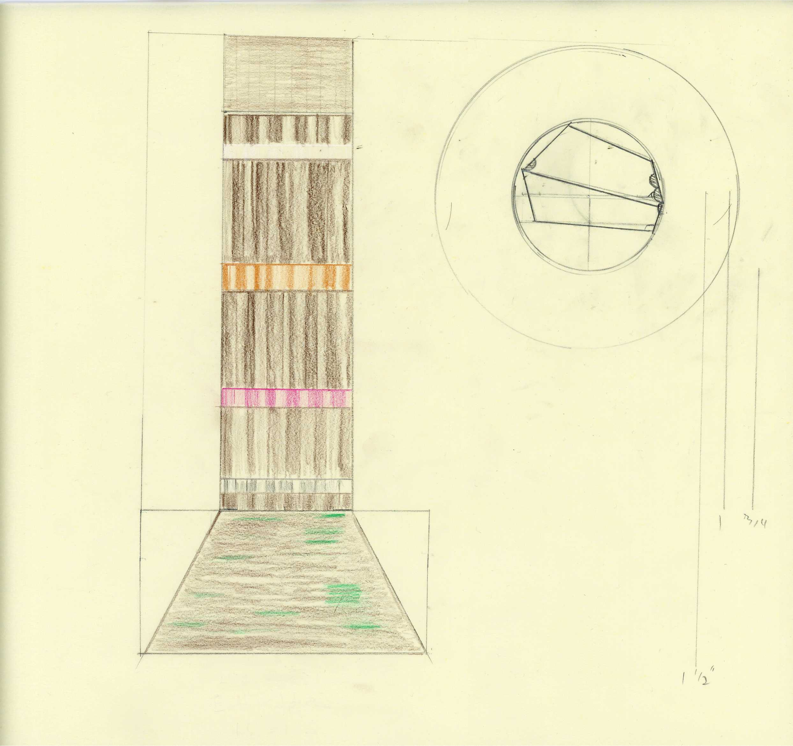

**July 15 2025**\
**Dorset, England**

Built an earthen sculpture with beautiful humans from around the world at the Architectural Association forest at Hooke Park. It was an honor to learn from architect [Paul Feeney](https://feeneyraue.com/) and earth building legend [Rowland Keable](https://www.ebuki.co/). We walked around the forest collecting clay and built large scale architectural interventions using earth building techniques. This monolithic sculpture was created using both rammed earth and cobbauge framing. A hybrid.