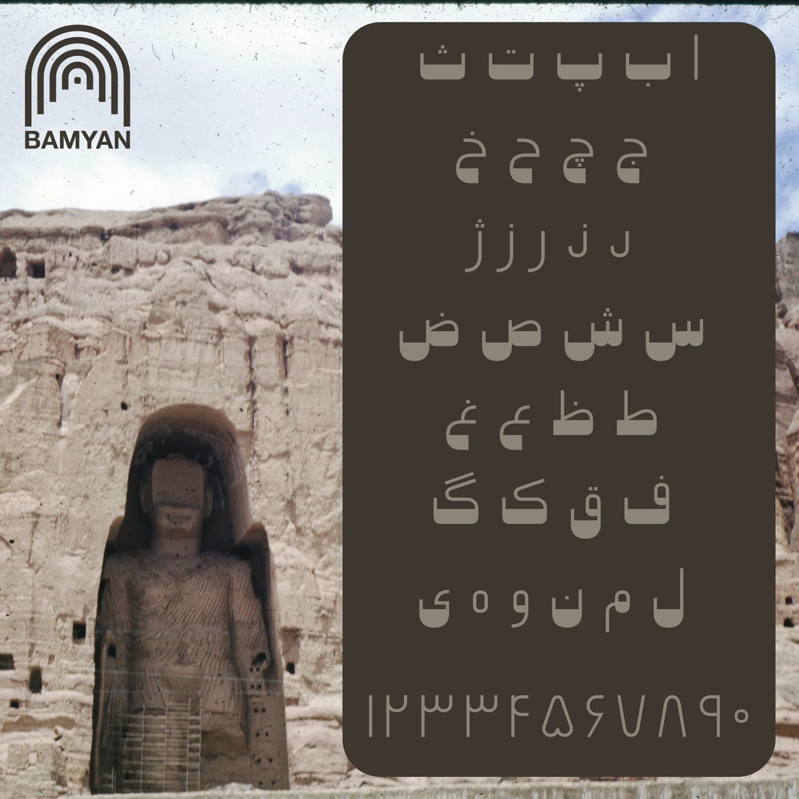
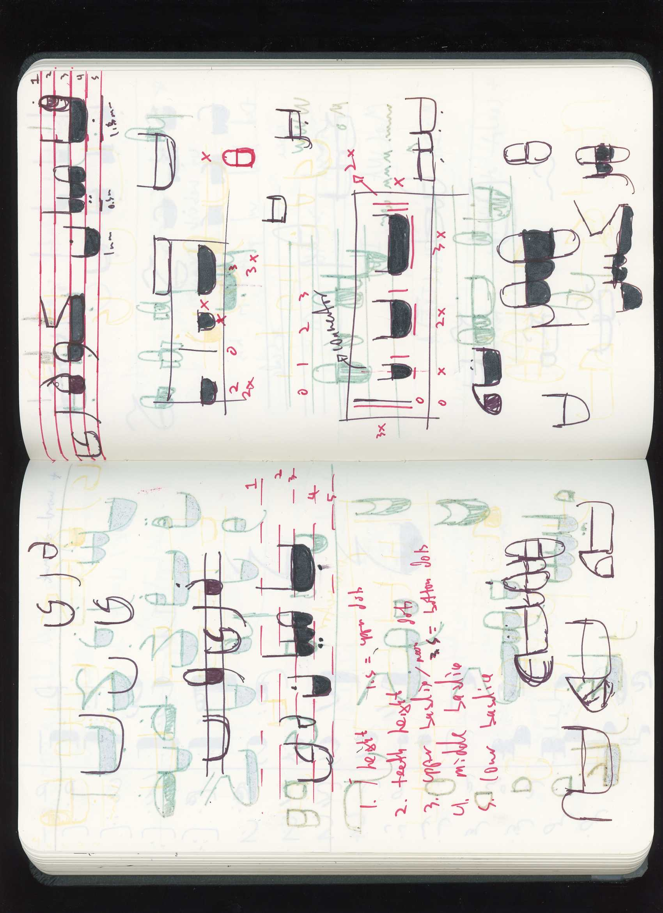

## باميان Bamyan 
Bamyan is a design project exploring the possibilities of a cultural typeface designed specifically for a region of Afghanistan. It makes reference to the Bamyan Valley of Afghanistan, its Buddhas, and the caves that inhabit it. Letterforms take on the curved structure of the hollowed out caves piercing the cliff side, while creating an homage to the topography of the region, both natural and man-made.

[Try & Download Bamyan](https://bamyan.omarmhmmd.com/)

 

### Book your trip to Bamyan, Afghanistan now!
Below is an excerpt of fiction, written from the perspective of me, had I been born and raised in Afghanistan and gone on to study design at Kabul University. My "thesis" at Kabul University materializes as a short film in this speculative world.

Using the medium of a mid-century tourism advertisement, the short film takes found footage of the Bamyan Valley paired with a song titled یک جهان اعجاز دارد بامیان, *Bamyan, a Miraclous World*, sung by Tahir and Zahir.[^1]

---

` `
### Kabul, Afghanistan
#### November 29, 1994
` `

<iframe 
  width="auto" 
  height="367" 
  src="https://www.youtube.com/embed/UXvTwVBYa0Y" 
  title="[Bamyan Typeface] Book your trip to Bamyan, Afghanistan now!" 
  frameborder="0" 
  allow="accelerometer; autoplay; clipboard-write; encrypted-media; gyroscope; picture-in-picture" 
  allowfullscreen
/>
` `

*Salaam, and thank you for watching this film. I'm Omar Mohammad, a designer based in Kabul, Afghanistan. While studying Design at Kabul University, the reality that our country lacks a contemporary cultural design language in many fields, especially architecture and graphic design, was a constant constraint in my work and research. My main focus as a student and now as a professional is about contributing to the cultural design language of Afghanistan through personal and commercial work.*

*My MFA thesis at university explored concepts surrounding the definition of Afghan design, the artifacts of Afghan design, and the history of Afghan design. Luckily the Ministry of Information & Culture was invited to the graduate exhibition show and took great notice of my work and research. The Ministry is currently searching for fresh thinkers and designers to contribute to government funded design projects. With the sudden western boom of tourism coming to the country, many of these projects are geared towards boosting the cultural tourism economy of Afghanistan.*

*The Buddhas of Bamyan have been a mainstay for those in the academic fields of archaeology, religion, and anthropology, yet they have not been fully utilized as a means for drawing foreigners and tourists into the country. Some of my thesis work explored graphic and visual identities in regards to this beautiful region, activating forms in the valley and landscape into cultural pieces of graphic/visual output. The Minister of Information and Culture, Ibrahim Nevin, took notice of this work and commissioned me to design a project about Bamyan that incorporated the work from my thesis. A cartoonist and filmmaker himself, Minister Nevin requested the final artifact to be a short film highlighting the beauty and wonders of the Bamyan Valley and its Buddhas.*

*The film includes original music, custom graphics and typography, and a personalized voiceover. I'd like to thank my classmates, colleagues, and professors at Kabul University for their support throughout this project. It's not much, but it's a first step towards creating a cultural design language for Afghanistan.*

**_- عمر محمد Omar Mohammad_**

---
` `

### Unrealized Archive 7: Text To Image, Seoul, South Korea

In May of 2023, the Bamyan typeface was exhibited in Seoul for [Unrealized Archive 7: Text to Image](https://unrealizedarchive.com/text-to-image/omar-mohammad/), a project by Chris Hamamoto & Jon Sueda exploring speculative and “unrealized” design through systematic conceptual approaches.

Unrealized Archive uncovers “unrealized” graphic design projects that consumed many hours—sometimes years—of work, but were never produced. Unlike in architecture and product design, where “unbuilt” or “speculative” work is forefronted as an important subject of critical discourse, most of these projects have until now been buried in flat files or deep in hard-drive storage.[^2]

Thank you *so much* to [Chris Hamamoto](http://chrishamamoto.com/) and [Jon Sueda](https://www.stripesf.com/) for inviting me to be a part of this beautiful project, and thank you to [Andy Chung](https://andychung.me/) for miraculously being in South Korea at the time and being able to see the show and snap these photos for me. 

### Documentation

### Visual Research
<iframe 
  width="auto" 
  height="367" 
  src="https://www.are.na/omar-mhmmd/bamyan/embed" title="Omar Mohammad's Are.na channel Bamyan"
  frameborder="0" 
  allow="accelerometer; autoplay; clipboard-write; encrypted-media; gyroscope; picture-in-picture" 
  allowfullscreen
/>
` `

This project's not much, but it’s a trying contribution to the cultural design language of Afghanistan. The typeface is a simple design, yes, but I’m hoping it inspires and encourages designers and artists from Afghanistan to push the limits and boundaries of our work, especially conceptually. Preserve, produce, and share our beautiful culture. 

**Omar Mohammad\
Berkeley, December 2022** 

---
` `
[^1]: Yak jahaan ejaaz daarad Bamiyan Hazara Song played on Dambura. Tahir and Zahir singing the Hazara Song Yak jahan ejaz darad bamiyan in front of the mountains of Bamiyan.
They sing and play Dambura. From https://www.youtube.com/watch?v=qNmd6P7lf1A
[^2]: https://unrealizedarchive.com/text-to-image/index.html

