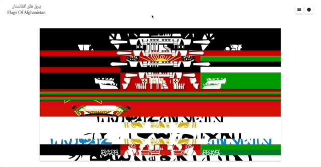
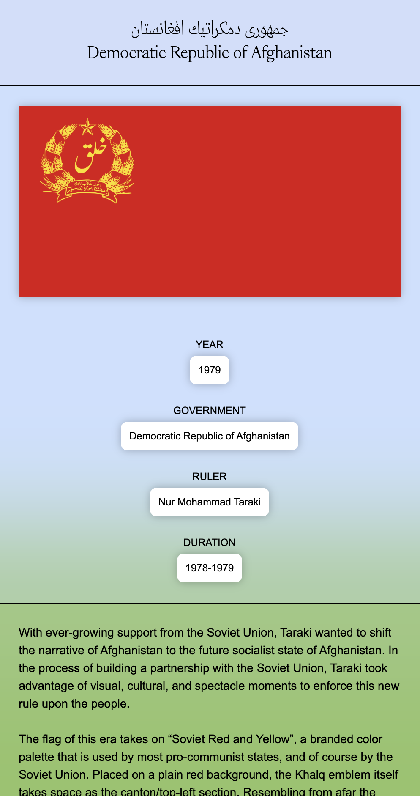
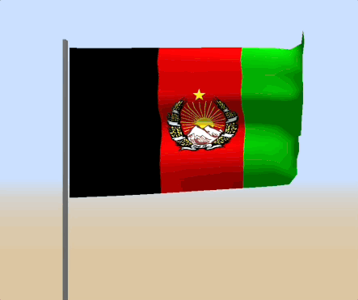
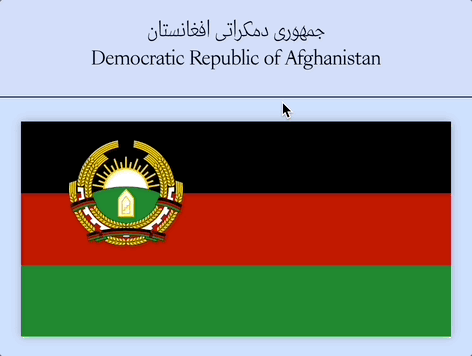
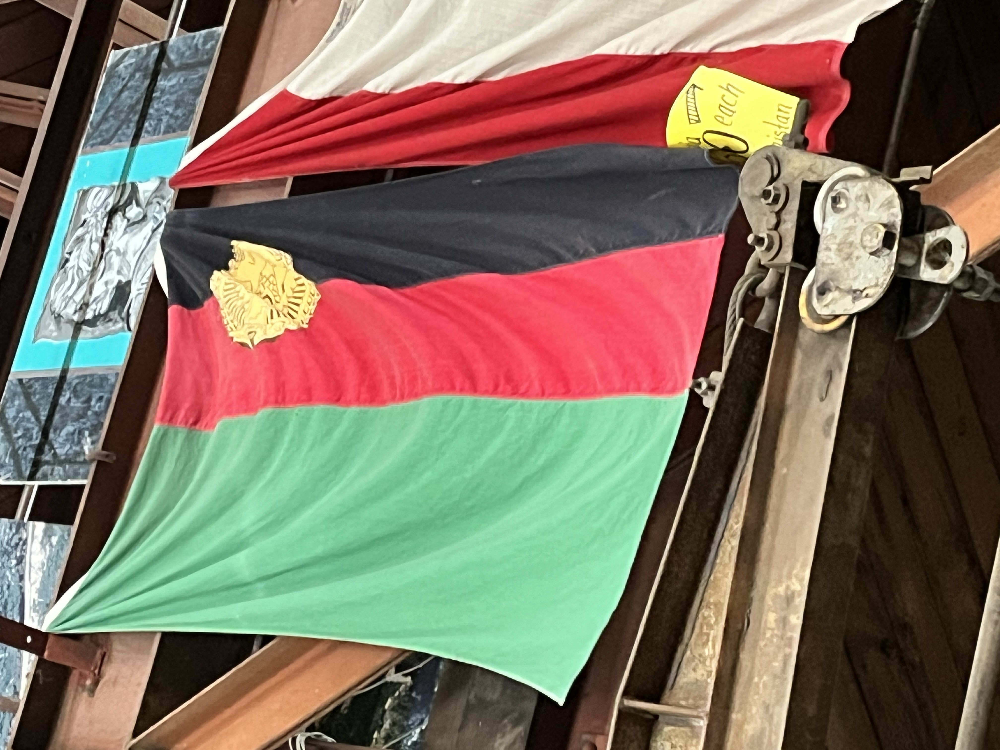
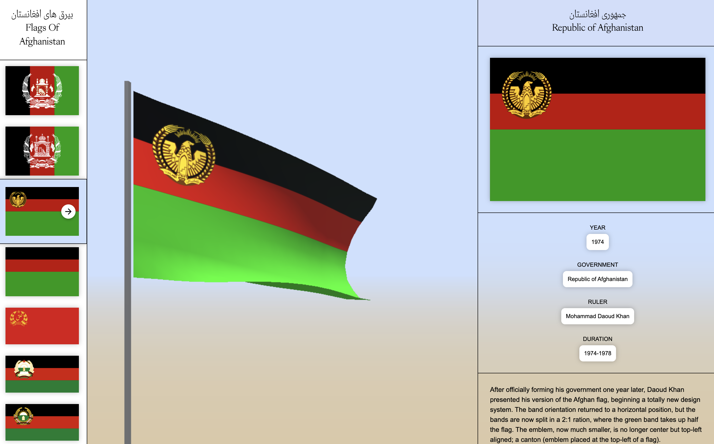
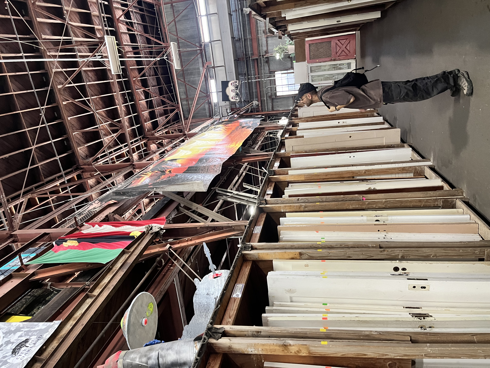
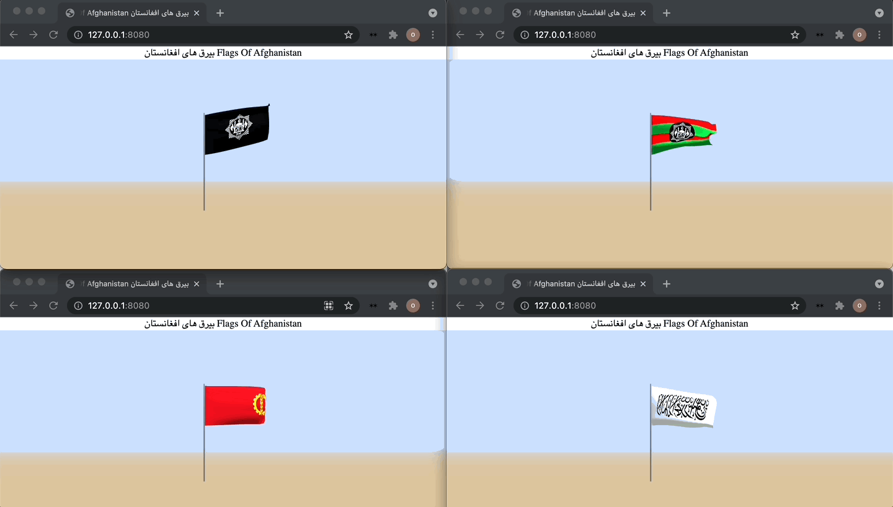
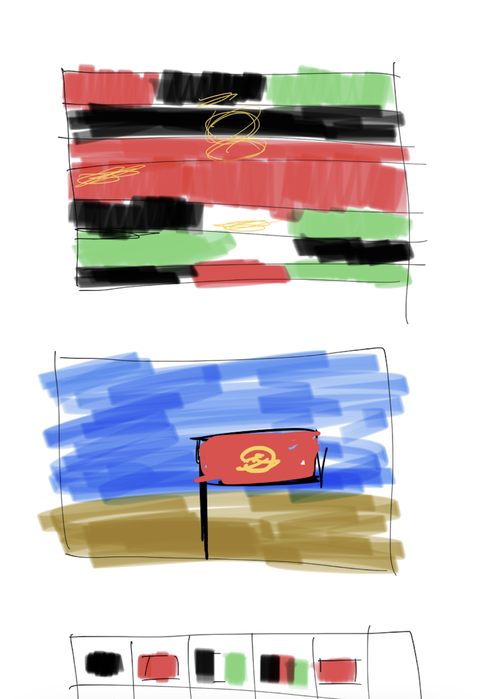

## بيرق هاى افغانستان Flags of Afghanistan 
Since the beginning of Afghanistan as a nation state, the design of its flag has existed in a constant state of flux. With each new leader, faction, or party gaining power, the flag and its emblem were altered to represent the new order in the country. Flags Of Afghanistan بيرق هاى افغانستان places these flags in political, cultural, and design contexts; building visual and historical relationships that aim to archive the past while informing the future.

[Flags of Afghanistan research website →](https://foa.omarmhmmd.com/)

### Website as Research
Flags of Afghanistan takes on the form of a research website, where flags billow through contact to digital air. Flags from the end of the 19th century up to the current day exist as simulacra, both as visual representations and as digital twins. 

 

Metadata regarding each flag is noted, while a historical narrative is written in regards to the political and cultural dynamics at play that mandated the flag changes. Each flag goes through an investigative process of a visual breakdown, examining colors, symbols, text, and image in relation to the meaning, culture, and ideologies they represent.

Utilizing this methodology, an entire history of the modern nation state of Afghanistan can be told, processed, and retold through its own flags. Novel and insightful findings reveal themselves that would otherwise be lost or impossible to decipher through a textual or literary reading.

 

 

### (Lack of) Definitive Sources for Flag Designs
As with much research into the design history of Afghanistan, there lacks much of a "definitive" source that is written by and for Afghans on the topic. Most of the flag images were found through internet searches, referencing obscure websites[^1] [^2], until some sort of pattern and relationship was discovered through historical fact checking (leaders, groups, and governments in power in relation to each flag). This research is incomplete; I apologize and take resonsibility for any errors and shortcomings in the historical details I’ve written about. I hope to build upon this project in the future and address all the gaps and misinformation that may be present. 

#### Visual Research
<iframe 
  width="auto" 
  height="367" 
  src="https://www.are.na/omar-mhmmd/flags-of-afghanistan/embed" title="Omar Mohammad's Are.na channel Flags of Afghanistan"
  frameborder="0" 
  allow="accelerometer; autoplay; clipboard-write; encrypted-media; gyroscope; picture-in-picture" 
  allowfullscreen
/>
` `

I intend to explore secondary sources such as world encylopedias from each year that is listed in this work to engage with an approximate source, versus unreliable website information. Perhaps I will find that the websites referenced are indeed valid through that process. 

### Flag of the Republic of Afghanistan 1974

In October of 2024, by God's will I came across the Republic of Afghanistan 1974 flag at the reuse store *Urban Ore* in Berkeley, CA. The flag was listed for sale, but the store would not grab a ladder, obtain the flag, and sell it to me. I was berated and told that the flag wasn't for sale. After pleading with the workers that I am Afghan and I do research on this exact flag, they simply walked away. 

 

 

This experience is a metaphorical embodiment of the way our histories, artifacts, and legacies are stolen from us, and kept in conditions where their worth and significance become non-existent. I am still working on getting this flag. 

 

 

 

### Community Research
If you have read this far (thank you for doing so), and know more about the Flags of Afghanistan, own physical flags, possess photos, or can contribute in anway possible, especially corrections, please write and let's work together to capture and rewrite this important history of our homeland. 

omar.mhmmd@gmail.com

` `

**Omar Mohammad\
Berkeley, May 2022** 

---
` `
[^1]: https://www.worldstatesmen.org/Afghanistan.htm#Qonduz
[^2]: https://ozoutback.com.au/Afghanistan/flags/index.html#more
