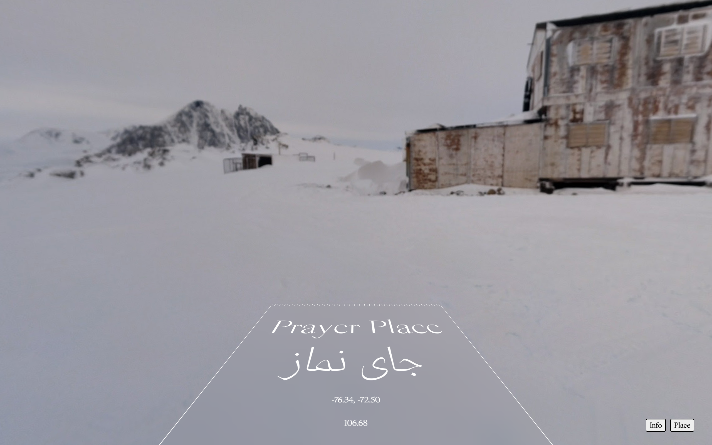

## جای نماز  Prayer Place 
In Farsi the word "prayer rug" is translated to جاینماز (jainamaaz). Breaking down the term further, the components become جای نماز, or "place of prayer". This translation differs greatly from its Arabic counterpart, سجادة الصلاة (sajjadat as-salat), which translates roughly to "bowing, or prostration rug". I think there is a beauty in both of these versions, but there is a poetic and abstracted gesture in the Farsi translation. It may stem from the beauty of classic Farsi poetry and literature, where the namer has given an object as simple as a rug a poetic identity; I have no idea.

[jainamaaz.omarmhmmd.com →](https://jainamaaz.omarmhmmd.com/)

 

### The Digital Qiblah
This website places the user on an abstracted prayer rug, in a panoramic landscape, facing the physical direction of Qiblah. Utilizing the Google StreetView API, I wrote some software that places the user in a random location somewhere on Earth. This location is then used to calculate the proper bearing to face Qiblah, and the StreetView camera is then pointed and fixed in that direction. Inspired by the use of VR/AR world exploration by many designers and engineers due to COVID-19, I wanted to imagine what a جای نماز, or "place of prayer", looked like from anywhere in the world. This was a COVID-19 project.

 

 

**Omar Mohammad\
Berkeley, December 2020** 
