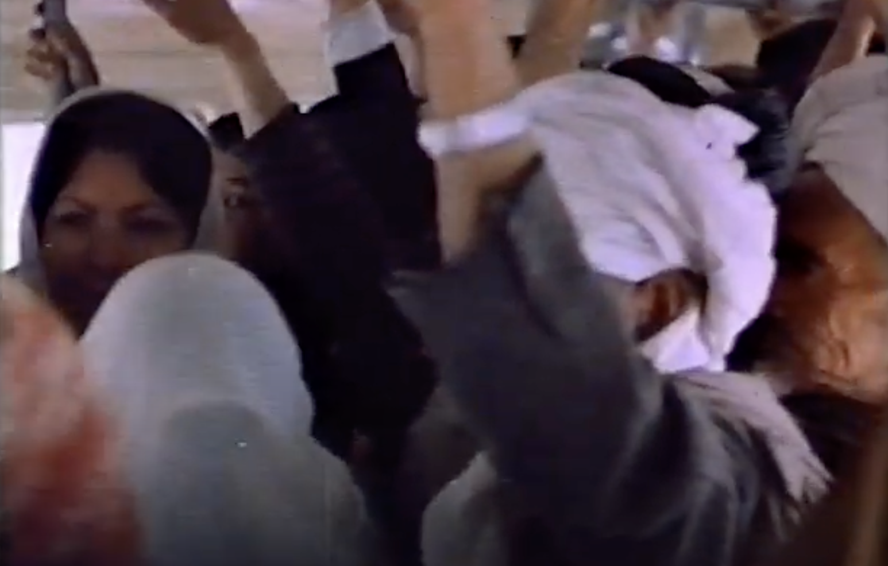
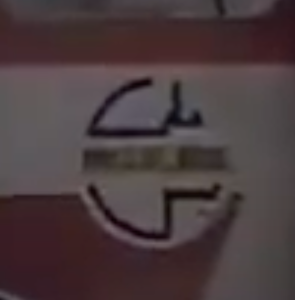

## Introduction (Part I)
Since I have embarked upon my graduate studies, my research has led to an immersion into the Afghanistan of my parents’ and grandparents’ era. This period of time spans from the birth of my maternal grandfather Abdul Qadir Simab in Kabul of 1923, to my mother’s final departure in 1981. My father immigrated alone, while my paternal grandparents remained in the north of the country, Imam Sahib, Kunduz province, until they passed away. The reason for both of my parents’ departures was due to the unrest caused by the interventions of the Soviet Union into what had become a communist Afghan state. My mother’s family has never returned home.

The Afghanistan my family knows, remembers, and lives by is an Afghanistan frozen in a moment of time. Although frozen in the past, this era (-1981) speaks more to a future vision of the country than as it exists today. It is this sorrow for the homeland, the guilt of leaving, and the shame of what has become that drives Afghans in diaspora to either forget the good that was, or to keep warming up that frozen Afghanistan floating in the timeline. 

There have been and are many ways to thaw the frozen Afghanistan; some will set on the long road of bureaucracy and politics, hoping that government intervention (national or abroad) can solve pertinent issues. Other’s will take the academic route, studying and writing about Afghan history, from the “Great Game” of the British forces in the 19th century, to the Soviet invasion, then next to the Civil War of the 90s, then onwards to a post 9/11 landscape...the list goes on. Many have found fortune in this business, Afghans and Westerners alike, but the time for trauma-informed work revolving around war, politics, and tragedy must come to an end.  

### Afghanistan & New Media
A totally new lens is required to examine Afghanistan with, one outside the scopes of business, law, engineering, and government, but one that is deeply rooted in the arts, social sciences, and culture. I have been developing this type of work through speculative design and software projects[^1], and most recently have begun research in the field of indigenous and vernacular Afghan architecture, uprooting traditional crafts to explore contemporary applications.[^2] I am not arguing that design and architecture could have “saved” Afghanistan, but I do believe that its lack of presence, gravitas, and existence within the fabric of the society for such a long time has caused ruptures that are hard to repair let alone heal. [^3] 

However, there is a discipline which brings together multiple facets of design, urban studies, technology, architecture, anthropology, and geography, that when combined form a new epistemological approach to thinking about and understanding the country. I argue that the discipline of new media can enable artists, designers, and researchers of all backgrounds to uncover hidden realities of Afghanistan, its past, its present, and its future. I will be doing this work by engaging with the transportation system of the rail as a mode of new media; a networked communication device possessing nodes embedded within cities and links within the countryside capable of uniting a mass of peoples under a unifying, cosmopolitan, diverse identity. 

In late 2021, I was conducting research for a design project titled [Marcaz مرکز](https://marcaz.org/), an online platform for new conversations about visual and digital culture from in and around Afghanistan and its diaspora.[^4] Sifting through newfound archives across the internet, I came across old newspapers from the 1920’s-1980s in Afghanistan. I was mostly interested in the Farsi typography and graphic design of logos and newspaper headlines, but in the process I would come across interesting articles and pieces of news. There was one article that shared not much value in design, yet possessed a headline that seared itself into my mind. On page 5 of the *Afghanistan Council Newsletter, Vol. 4, No. 3 (Fall 1976)* [^5], in the top right corner, a medium sized heading reads, “Afghanistan to have railway network by 1983”.

### An Afghan railroad?

The article reads to say that Iran has agreed to fund a railway line that will finally connect Afghanistan to Europe, “providing vital access to the outside world”. [^6] There is no description of how this new rail will influence communications, travel, or any reference to the rails being designated as passenger specific; its main reasons for support are trade, detailed by the possibility of a freight train to a major iron ore deposit northwest of Kabul.

The route for this proposal is mentioned to run west from the border of Iran to Herat, from Herat southeast to Kandahar, and from Kandahar north to Kabul. Again, no mention of the connecting of cities/villages/provinces in between. As with any state or province, the major city is the main source of culture, education, happenings, and transportation (airports and train stations etc.). Kabul and Afghanistan is no different. As an ancestral anecdote, my mother’s family is from Kabul, and my mother will often joke with my father about how he is from the northern “countryside” where they lacked certain first-class education and culture. On the contrary, my father is proud to be from the countryside and rejects the urban chaos and pretentiousness that exists in Kabul. 

All jokes aside, this major difference in culture between Kabul and Kunduz is separated by roughly 300km/200mi, a distance here in the West that takes about 3 hours to drive in prime conditions. Afghanistan is roughly the size of Texas, yet its beauty lies in the major cultural, ethnic, linguistic, and religious diversity that exists within a border that small. How would the fabric of Afghan society have formed itself had a distance that small been connected by a communication network of rail during the formative moments of global modernism? A connection of people and ideas scattered throughout the country, within the framework of something as simple as a train, has the potential for something great to happen within the history of Afghanistan. I cannot build and implement the first Afghan passenger train railway, but I can design one through a speculative fashion. 

### Cinema & The Train
A new media city, for me, is one that is connected by means of analog and digital communication networks. These networks range from physical transportation systems such as the railway and interconnected highways, to the analog/digital hybrid of radio communication, and to the often invisible but physically embedded internet infrastructure. What all of these networks have in common is the shared responsibility to transport information from one location in space and time to another. People, cultures, ideas, languages, maps, religions, tales; information not in the numerical sense, but in an anthropological one.

Overtime the network gradually transforms from one that is tangible and visible to one that exists primarily within our machines and mobile screens. In *The Language of New Media*, Lev Manovich introduces his readers to his concept of new media within the framework of five principles for new media:

1: Numerical Representation
\
2: Modularity
\
3: Automation
\
4: Variability
\
5: Transcoding

He goes on to introduce *cinema* as an older form of media with which all five principles still apply to.[^7] Using Manovich’s cinema as a primary framework to wrap the origins of new media around, Nanna Verhoeff in *Mobile Screens-The Visual Regime of Navigation* introduces the train as the cinema’s analog counterpart. Verhoeff introduces her reader to the 2010 exhibition by the EYE Film Institute Netherlands titled *Zoomscape*, an exhibition about film, trains and perception. [^8] The curator of the exhibition writes:

*Trains and films go hand-in-hand. When the first trains chugged up to speed around 1835 they changed the way we experience reality. The world became a moving image, the carriage windows an imaginary film screen which new horizons passed by on.*[^9]

Both Manovich and Verhoeff utilize the cinema and the train, respectively, as a precursor and definitive moment of the way humans engage with information through space, time, and environment. The window of the train allowed for scenes of reality that are impossible to experience otherwise, a feat that the film camera engineered in its own right. The processing and transferring of data from the movie screen and the train window to the viewer, however, rarely happens in isolation. The edifice of the actual cinema/theatre, with its rows of seats and close proximity, and the train car with its own set of seats and often times extreme close proximity, sometimes through standing, is a physical, social network in itself. A timed social network, in the case of a film a matter of hours, or in the case of the train, sometimes hours, a day, or even more, humans are contained within a shared space emitting personal feedback amidst an experience of absorbing feedback produced by those in shared space. New media is a media that *cannot* happen in isolation. Interactivity between machines and networks, humans and machines, networks and humans, and humans and humans produce the side effect of what makes new media, “new”. 

### Amanullah Khan’s modernist visions
Under King Zahir Shah from 1933-1973, Afghanistan as a nation reached a state of peace that some may argue was the “golden age” of the country. Modernization moved slowly, which pleased the city dwellers with its progress for progress’ sake, yet this rate also pleased those living in the country side, the “traditionalists” who were cautious about the rapid globalization and modernization of the country.[^10] The culture of major cities including Kabul (the strongest influence), Herat, Mazar-e-Sharif, and Kandahar grew alongside the new media that was being introduced gradually: radio, cinema, television, and buses. However, this introduction of new media did not have the same affect on those outside of the major cities, partly because those areas were rarely introduced to new media communication technology to begin with.

Villages and towns on the periphery were treated as second class subjects. This divide between city and rural social and cultural life began during the reign of the previous king Amanullah Khan who ruled from 1919 to 1929. Amanullah was the first Afghan leader to attempt a sudden and forceful “modernization” of the country. After a famed visit across much of Europe in 1928, with an emphasis on Britain, France, and Germany, Amanullah returned with a plan to bring his country out of the dark ages to the western light.[^11] A prime example of this was the unveiling of his wife, Queen Soraya Tarzi, in public. Muslim women at this time in Afghanistan practiced the veil, or *چادر chadar*, in most public settings. Even in the cities, the veil was practiced, but when Queen Soraya returned from her European voyage, the veil was removed, and even attempted to ban.

I use the case of the veil to tell the story of the nuances between culture within Afghanistan in the early 20th century. The cities, Kabul especially, applied Amanullah’s modernization efforts rapidly, however those in the villages throughout the country saw Amanullah’s modernist reform as a threat to their conservative culture. Eventually a former soldier by the name of Habibullah Kalakani organized an uprising against Amanullah and his western ideals and eventually drove him out of the country. Kalakani’s traditional rule ended within the year however, and Mohammad Nadir Shah, and soon son Zahir Shah, ruled as kings for the next 50 plus years, abolishing Amanullahs hasty reforms, yet still applying modernization efforts at a slower, more acceptable rate. 

I bring up this bit of history to illustrate the dynamics at play between city folks, the elite, and the educated, versus the rural folk, the tribal and the nomads, or the ones living “off the grid” as we would call it now. To this day, Afghanistan exists in such a way, which makes a unifying national and cultural identity such a challenge. Each ethnic group shares and develops a subculture of their own, dependent on their tribal cultures. This is highly reflected in the language, music, and architecture of different regions within Afghanistan.

But what if Amanullah’s intentions were not full of malice, but only his concept of modernization was incorrect? Rather than take his own people’s culture into consideration, he made a rash decision to become more like the west. Although problematic in a homogenized/globalized sense, the west *has* been able to create successful nation states that share a unified culture and DNA, even amongst those diverse populations that live within them. I argue that new media is the device that has allowed western societies to create this unified identity. And in the case of Afghanistan, I argue that it was the *lack* of a national rail system, what I would define as the origin of new media through the combined lens’ of Manovich and Verhoeff, that has led to a constant division between a people of the same land.

### The Train, The Bus, and their Passengers
Since the end of the 19th century the surrounding countries of Afghanistan: Iran, Uzbekistan, Tajikistan, and Pakistan (then India) all had some sort of rail lines constructed, freight or passenger. At this time, Uzbekistan and Tajikistan were under Soviet government control, and the region of Pakistan (India) was under colonial British rule. Many lines were built reaching the Afghan border, and many proposals were forwarded to the government by both the Soviets and the British, and other European states. During this time the Emir Abdurrahman Khan, grandfather of modernist reformer Amanullah Khan, was placed in the middle of the “Great Game”; a Cold War type battle for Afghanistan by Russian and British colonial forces. In order to protect his country from foreign interest, Abdurrahman wanted to keep his country as isolated as possible, free of a rail that could be utilized by invading forces.[^12]

This keyword of *isolation* is the exact issue at hand. Fast forward to 1994 and the end of the Afghan civil war post-Soviet withdrawal; the Taliban came out on top and immediately banned the internet to keep the country isolated from outside influence. 1994! This was the *exact time* to *get* on the internet. From 1994-2001 Afghanistan lacked internet network infrastructure. At a time so pivotal to the global development of individuals and societies on both the micro and macro scale, Afghanistan’s communication infrastructure was again left in the dark. The lack of a rail line in the name of “preservation” of country carried on by Abdurrahman, I believe, has had the same exact effect on the country as the internet ban by the Taliban has had. It is not that Afghanistan has remained “backwards”; there is a thriving economy, development, and infrastructural work happening at an exponential rate, but it has yet to have the opportunity to jump into the future on its own terms as a democratic, united people.[^13]

Focusing shortly on Kabul as a new media city within the context of Afghanistan, we will look at how the implementation of public transportation led to a successful “modern” city, where folks of all backgrounds were unified under the “كابلى Kabuli” identity. To be كابلى Kabuli was to identify as city-folk. Understanding levels of inner-city privilege, to be an upper-class كابلى Kabuli meant to attend school, go to university, work in an office, watch movies at the cinema, and take the bus. One could dress how they want and do what they want. When in such a crowded environment, the individual blends in no matter their irregularities; this cosmopolitan energy led to the success of my family’s generation in Kabul. 

On the public bus one would find a religious elder clad in turban and traditional clothing, a youth wearing western clothes, a woman with her hair flowing, and a veiled mother  carrying her baby; it is an extremely beautiful image to see. In the short film titled آرزو The Wish (date unknown), a film by همایون مروت Homayun Morowat, the viewer is carried through a city montage of Kabul through a narrative told from the first person perspective of the bus itself.

<iframe 
  width="auto" 
  height="367" 
  src="https://www.youtube.com/embed/LUCz7XIQgmE" 
  title="YouTube video player" 
  frameborder="0" 
  allow="accelerometer; autoplay; clipboard-write; encrypted-media; gyroscope; picture-in-picture" 
  allowfullscreen
/>
\
The bus is anthropomorphized and tells the tales of the many different riders he knows and cares for, and how his job is to take care of the different people of Kabul by providing them this transportation service. It is a beautiful film that brought me to tears. Below are stills:   

In *Charles Baudelaire: A Lyric Poet in the Era of High Capitalism*, Walter Benjamin writes about the flaneur’s relationship to the city, forming the city as the true existence of the flaneur, without which the flaneur ceases to exist. On the topic of how an individual who may not identify as a flaneur must adapt themselves to the peculiarities of a city, Benjamin quotes sociologist Georg Simmel:

'Someone who sees without hearing is much more uneasy than someone who hears without seeing. In this there is something characteristic of the sociology of the big city. Interpersonal relationships in big cities are distinguished by a marked preponderance of the activity of the eye over the activity of the ear. *The main reason for this is the public means of transportation*. Before the development of buses, railroads, and trams in the nineteenth century, people had never been in a position of having to look at one another for long minutes or even hours without speaking to one another.’[^15]

It is by the quick and simple visual sense of sight that humans can come to know one another, either through judgment, or inquiry, or even curiosity. But it is at this moment that Benjamin and Simmel are stating that *something happens* when humans are forced within the confines of the bus or the train, forced to exist in a confined space with one who is *nothing* like you, or even yet, nothing *to* you. Forced to enter or exit at the same spot, sit next to one another, or by God’s good grace even speak to one another, perhaps an understanding can be made. A sacred covenant between the the local Kabuli city dweller, and the worker visiting temporarily from the country side in Kunduz, can be made in those tense, stressful moments of forced co-existence. As the two part ways, the Kunduzi exists within the Kabuli, and the Kabuli exists within the Kunduzi. Who knows who else they may share that essence with?

Kabul as a new media city proves successful between the time span post Habibullah Kalakani’s takeover (1929) until the soviet invasion (1979). These 50 years saw major progress within Kabul, as my mother, grandparents, uncles, and aunts testify to. Sadly I do not have the resources or the scope to investigate what was occurring within the other major cities, such as Herat or Mazar-e-Sharif, but I was able to ask my father, Said Mohammad, about how things were going on in the north in Imam Sahib, Kunduz. He mentioned that there weren’t many buses, but there *were* horse-drawn carriages...My mother’s point proven I suppose!

The bus system in Kabul was a public bus system owned by the government called ملى بس Millie Bus, or National Bus; ملى millie means national in Farsi.[^16] Although named “National”, it only stayed within city limits. The bus was my family’s main method of transport in Kabul from its origins until they left in 1981. By the end of the soviet invasion and the civil war, Millie Bus’ infrastructure was completely destroyed. Today Millie Bus is gaining government attention and funding once more; the infrastructure was never able to recover after so many years of destruction, but the process is ongoing.[^17] 

--- 
` `
## A Fictional History, a Speculative Future (Part II)
Utilizing the framework of the Millie Bus, a device used to unify a people and create a network of information transfer between them within the new media city of Kabul, I propose the ملى قطار Millie Rail (National Rail). ملى قطار Millie Rail will be utilized as a device to unify the entire people of Afghanistan and create a network of information transfer between them within the new media *nation* of Afghanistan.

### ملى قطار Millie Rail

Had a national passenger railway in Afghanistan been designed and implemented in the early 20th century, perhaps the Afghanistan of today would have ended up a little different. I am speculating, a pure and perhaps naive speculation, that through an experience of clashing cultures and ideologies accelerated by rail travel, the constant division the country has experienced since 1929, then 1979, then 1994, then 2001, then 2021, may have never occurred. Instead of this division, a unity umbrellaed by a network of the capital, major cities, towns, and villages had a potential to exist. 

In order to demonstrate this concept within the constraints of this work, I will be using digital media, graphic design, and sketches to communicate a speculative vision for the Afghan national rail. The purpose of this is to create a fictional history through speculative means where the spirit of the idea of the train exists. Through image-making, I am hoping to provoke perceptions and realities of the history of Afghanistan, while using prior cultural context to inform a speculative reality. I will do this by designing actual artifacts, and writing supplemental text to give context to design decisions, concepts, and potential outcomes.

### Naming
To name something is to give it existence. The names of our public institutions become significant to the cultural identification of our locations. In the Bay Area, we have *Bay Area Rapid Transit*, our geo-specific train transit. Nation wide, the passenger rail in the USA is called *Amtrak*, a portmanteau of the words “America” and “track”. For Afghanistan, the closest resemblance to an institution as such is the ملى بس Millie Bus, as discussed previously. This name carries a sense of nostalgia for my family and relatives who lived in Kabul. When asking my grandmother, Sharifa Simab, what the bus system was called, I could see her eyes light up with a whole vision of her past. Asking simply for the name of the bus, she began to recall the name of the streets, the certain bus stops she would take, the times she would need to make it on time. My mother, Fariha Mohammad, who sat close by chimed in on how “cute” the young men who drove the buses were, noting how she and her girlfriends would take the same bus everyday to match with their favorite driver. The bus, for my teenage mother, became a form of a social network, meeting her friends, crushing on boys, and it was with the simple memory of the name that these memories came flowing back. At a much larger scale, could a railway have done the same thing?

Using ملى بس Millie Bus as the framework for much of this work, it feels natural to evolve from the bus to the train with ملى قطار Millie Rail. Here بس in Farsi transliterates to “bus”, where the word for bus is shared between Farsi/English. In the case of the train, قطار transliterates to “qataar”, a word meaning train/rail[^18] in Farsi, borrowed from Arabic which means a “row of camels” and “train”. [^19]. ملى قطار Millie Rail is to be used as a familiar device for those accustomed to the ملى بس Millie Bus institution. 

### Logo
As with naming, the logo carries on the existence and soul of the institution it represents. For Bay Area natives, the BART logo represents home, and has been reconceptualized, remixed, and recycled as clothing logos, album art, stickers, etc. The BART logo has become culture itself. In my research of Afghan graphic design, I have been unsuccessful in uncovering graphic designers of the modern era and their works. I have just recently come across architectural references, but am having no luck with graphic design. I hope to come across this work soon. 

The ملى بس Millie Bus logo surfaced itself in the آرزو The Wish documentary. A YouTube channel called “تلنگر Talangar”, created a documentary on the crumbling Millie Bus infrastructure ten years ago, and it is through this video that I have surfaced higher-resolution images of the ملى بس Millie Bus. The images above show the old logo in tact (at low resolution), and eventually an image that shows the lack of importance paid to the application, one stenciled with spray paint and the other decaying. There is no standard guideline for how to design the word mark, but the framework is there:

1: A circle frame that locks up the logo
\
2: A center horizontal band in yellow that reads the English “Millie-Bus” in black is constant on white backgrounds
\
3: The top portion reads ملىى Millie, where the last letter “ى” is stylized in a manner to shape the “tail” upwards into a quarter circle shape
\
4: The bottom portion reads بس Bus, where the last letter “س” is stylized in a manner to shape the “tail” downwards into a quarter circle shape

It appears that there is no standardization to the execution in the examples I have sourced, however following those guidelines seems to get the job done. I will be executing the ملى قطار Millie Rail logo in similar fashion. 

The following are a set of speculative logos I designed based on the found material above demonstrating a shared identity between the Millie Bus and Millie Rail institutions. 

The Millie Bus logo is replicated nearly 1:1 as it is found from the visual research I conducted, and the Millie Rail logo borrows similar visual relationships, with a custom drawn قطار lettering.

### Map
As with the BART logo, the BART map unifies the Bay Area within a particular region. The BART map can be utilized to define and mark where the cultural bounds of Bay Area culture begins and ends, along with demarcating the limits of subcultures regarding the multiple regions: East Bay, San Francisco, Oakland, Peninsula, San Jose.   

Although subcultures, ideologies, economics, and politics may differ between the inner East Bay the end of the Richmond line, the BART map creates an interconnectedness between riders. As an analog New Media device embodied within the city, all maps depicting such information create a new type of networked topology with which an individual can come to ontological definitions about themselves and others within their shared environment. Working with Afghanistan’s smaller scale, we can transpose the networked rail map from the city, to the region, and ultimately to the nation. The map here will act as the most critical of artifacts to speculate on the side-effects of the existence of the ملى قطار Millie Rail.

The following is a speculative ملى قطار Millie Rail map I designed based on a multitude of visual map research in regards to Afghanistan.[^24] The origins of this research revolve around Afghanistan’s Highway One, or A01. This highway is the world’s longest looped, consecutive ring road[^25], while more than two-thirds of the country’s population live within 30 miles of it.[^26] An invisible piece of infrastructure, the potential to create a national and cultural unity and identity, the ملى قطار Millie Rail is now superimposed on this existing network, connecting the most major cities, along with smaller towns and villages along the way. Offshoots exist in areas where populations exist a great scale outside the loop, while an inner loop may be executed during further research.

The loop, coincidentally and conveniently, borrows from the circular visual language existing in the original ملى بس Millie Bus logo. These semi and quarter circle shapes create a consistent relationship between the graphic identity, all centered around the constant idea of a “ring” connecting *all* of Afghanistan together.

### Conclusion
The outcome I have presented is only a fraction of the work and research I have conducted in regards to the topic of Afghanistan and its lack of rail. It has been an extremely beautiful research process that I hope does not come to an end, however sources and citations on this topic are limited, as is with many topics regarding design, architecture, and communication technologies in Afghanistan; the purpose of this work is to finally change that and develop new work that can be traced, documented, and referenced in the future. For these reasons, in my work I approach Afghan design through a speculative lens, imagining pasts and futures through the small lens of Afghan culture that I posses.

With the research and work contained in this paper, I myself am now at the point of “so what?”. When I imagine ideal next steps, I hope to share this work in order to generate and kickstart the imagination of young Afghan students and thinkers to see how design can influence new ways of thinking about our country. I am hoping to push the design output to consist of urban poster mockups, architectural renders of train stations, and even the inside of an “Afghan car train” where people sit on the floor against Afghan rugs and pillows as they do in their homes. Pushing the boundaries of design through theoretical new media approaches is a space I see this work addressing, and hopefully inspiring more to do the same.

I by no means see this paper as being “done”, but as a device to kickstart the next chapter of work through dialogue and discourse, unlocking more historical research that will enable myself and other Afghan designers to develop a firm base to keep adding to. Perhaps one day all Afghans will come together to ride the ملى قطار Millie Rail from the north to the south, and from the east to the west of our beautiful homeland. 

**Omar Mohammad\
Berkeley, December 2024** 

---
` `
[^1]: See projects: https://omarmhmmd.com/
[^2]: Senj: Afghan Wood Framing Technology https://eartharchitecture.org/?p=1887
[^3]: For example, Kabul University, the premier university of Afghanistan, began an Architecture program in 1967. By 1985, for reasons unknown within this scope of research (although I assume the ongoing battles between Soviet/Communist forces and the Afghan Mujahideen raged on, causing fragmentations across daily life) the last class of the Department of Architecture graduated. It took 17 years for the next group of architecture and design students to graduate from Kabul University. During this time, the Department of Engineering took over. https://www.ku.edu.af/en/history  
[^4]: https://marcaz.org/  
[^5]: https://repository.arizona.edu/handle/10150/661682?show=full  
[^6]: “Afghanistan Council Newsletter,” Fall 1976, Vol. IV, No. 3 edition. p.5  
[^7]: Lev Manovich, The Language of New Media, 8. print, A Leonardo Book (Cambridge, Mass.: MIT Press, 2001), 64.  
[^8]: Nanna Verhoeff, Mobile Screens: The Visual Regime of Navigation, MediaMatters (Amsterdam: Amsterdam University Press, 2012), p.116.  
[^9]: ibid, 117.  
[^10]: There are not many ways to tell this story in a western sense without creating a binary between “liberal/conservative” or “secularist/religious”; the reality of the social and cultural fabric of Afghanistan is extremely nuanced. It may help to think of the traditionalists more as safeguarding an indigenous type of culture, rather than anti-western approach as the media has caused the masses to believe.  
[^11]: https://www.andrewgrantham.co.uk/afghanistan/railways/king-amanullahs-travels/#fn-1459-1  
[^12]: Paul E. Waters, Afghanistan: A Railway History (Bromley: PWA, 2002), 6.  
[^13]: The Taliban are in power again in 2024, implementing similar dystopic rules and laws as before, especially against women, but today they need the internet themselves, so it remains.  
[^14]: https://www.youtube.com/watch?v=LUCz7XIQgmE  
[^15]: Walter Benjamin, Charles Baudelaire: A Lyric Poet in the Era of High Capitalism (London: Verso, 1996), 38.  
[^16]: https://www.afghan-bios.info/index.php?option=com_afghanbios&id=5174&task=view&total=5162&start=2840&Itemid=2  
[^17]: https://www.youtube.com/watch?v=bDlEFFVoJbg  
[^18]: I am using the words “train” and “rail” interchangeably as a pure aesthetic decision; rail relates broader to the concept of a “railway” whereas a train remains isolated in definition, and it also flows off the tongue in a more natural way in the Farsi accent, versus “train”.  
[^19]: https://en.wiktionary.org/wiki/%D9%82%D8%B7%D8%A7%D8%B1  
[^20]: https://www.youtube.com/watch?v=LUCz7XIQgmE  
[^21]: https://www.youtube.com/watch?v=bDlEFFVoJbg  
[^22]: ibid.  
[^23]: ibid.  
[^24]: The original source of research I came across that inspired this map was a drawing of the paved and unpaved roads by Rafi Samiszay. RAFI SAMIZAY, “URBAN GROWTH AND RESIDENTIAL PROTOTYPES IN KABUL, AFGHANISTAN by M. RAFI SAMIZAY” (MIT, 1974), 13.  
[^25]: https://www.guinnessworldrecords.com/world-records/62921-longest-ring-road  
[^26]: https://www.washingtonpost.com/world/paving-the-way-for-roads-in-afghanistan/2014/01/30/f2f5437e-8a18-11e3-833c-33098f9e5267_graphic.html  
[^27]: Photo by Gerd Eichmann, Kabul in Afghanistan 1976, CC BY-SA 4.0  

