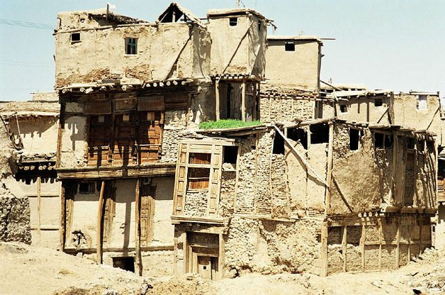
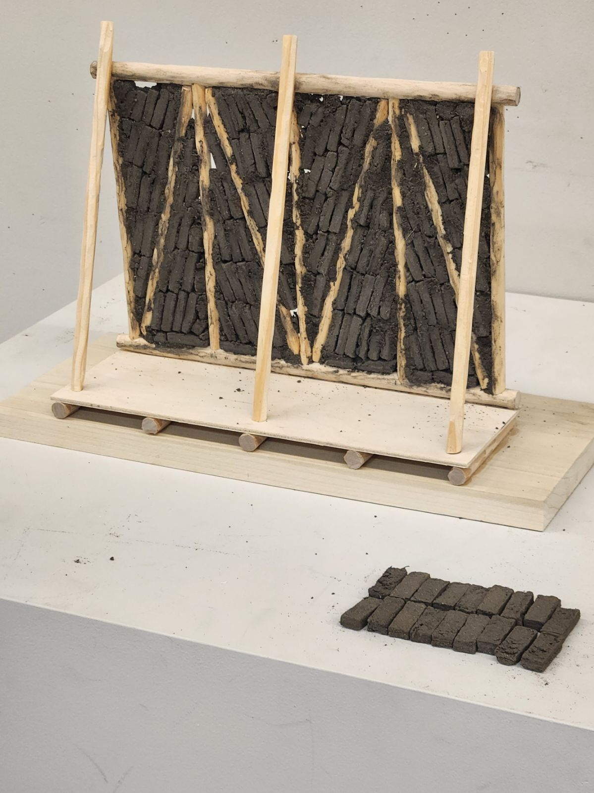

# سنج Senj: Afghan wood framing technology

سنج Senj is a traditional Afghan wood framing technique. It is a lightweight, flexible, and modular system designed to be placed on upper levels of structures within earthquake prone regions of Afghanistan.

The frame is constructed with poplar poles on a flat surface and is joined together to create square or rectangular walls. The
horizontal poles are around 15-20cm in diameter, and the vertical/diagonal poles around 10-15cm.[^1] They are joined by mortise
and tenon about 1m apart, where they are then lifted and filled with sun-dried bricks, placed at a diagonal relationship between
the vertical and diagonal poles.

In the photo above, we see a group of men sourcing poles from a poplar stand.[^2] The poplar species commonly used in
Afghanistan is the *populas alba*, or white poplar, سفيدار (safaidaar). The poles are commonly referred to as دستك (destak), a
beam, round in cross section.[^3]

The infilled brick frames are then plastered with a mud and straw mixture on both the interior and the exterior facades. Itseems that over time, however, the diagonal poles have been integrated into the complete frame, plastered over and completely hidden. Notice this drawing:

The diagonal bracing pole is left exposed outside of the plaster, as seen in these photos:

Here on the left side wall, all poles have been plastered over and no remnants of the structure are exposed. Could the strength have increased by having the diagonals be integrated into the frame, rather than existing on the exterior of it?

In *Afghanistan: An Atlas of Indigenous Domestic Architecture*, the authors state that diagonal poles are *nailed* at the exterior corners to stabilize the frame, not integrated within the frame itself. It is beautiful to witness the underlying structure with the poplar poles exposed as such in the older buildings, and saddening to see that design decision disappear over time. Even more so it is a shame the patterning that the bricks create are also plastered over and disappear. We wonder how senj technology can be re-contextualized contemporarily to become a textural, aesthetic, modular device while also supplying firm, structural integrity to a design.

### Model

The سنج Senj model is constructed with pine dowels, a poplar base, and sun dried bricks. These sun dried bricks were made in my garage, using soil sourced by Professor Rael. 

Unlike most traditional and indigenous earthen architecture of Afghanistan, سنج Senj is the only to incorporate wood as a structural support. Earth and wood come together as literal Earthen materials to define a hybrid material culture; whereas the Earth gave structure and support to the growing roots of the Poplar, the Poplar now returns the favor and provides a framework for the Earth.

This research was conducted in at the UC Berkeley College of Environmental design in the course *‌Earthen Material Practices in Contemporary Art and Architecture*, taught by Professor Ronald Rael. This research and model is just the beginning of many projects in regards to the earthen, indigenous, and traditional architecture of Afghanistan and its surrounding regions that I hope to design and research. 

Thank you so much to Professor Rael for opening the doors of knowledge, wisdom, research, and discovery of ancestral design
within the context of architecture at UC Berkeley, and thank you to my project partner Monica Leslie for all of the guidance and
support.

**Omar Mohammad\
Berkeley, November 2024**

---
` `
[^1]: Szabo, Albert, and Thomas Jefferson Barfield. 1991. *Afghanistan: An Atlas of Indigenous Domestic Architecture*. Austin:
University of Texas Press, p. 153.
[^2]: May, Silvio. [*Poplars in Afghanistan*](https://openknowledge.fao.org/server/api/core/bitstreams/b71c73a7-c93b-43d0-8ae6-08b2054061ac/content/n2550e06.htm#TopOfPage), *Unasylva, Food and Agriculture Organization of the United Nations*, Vol. 31 - No. 124, 1979.
[^3]: Hallet, Stanley Ira, and Rafi Samizay. 1980. *Traditional Architecture of Afghanistan*. New York: Garland STPM Press, p. 189/199.
