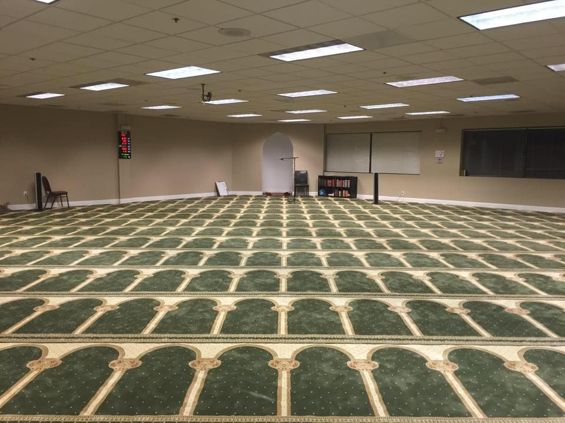

## The American Mosque
### What, How, and Where to Build
` `

In Islam, the architecture of a mosque is able to create personal, geographical, and regional cultural identities pertaining to the place and boundaries of space it is located within. The mosque acts not only as a spiritual place of prayer, but as an important space for the community to grow together, as a beacon of the existence of Islam in reference to the culture of a particular region, and as a space for Muslims to share, create, and grow identity. The architectural identity of mosques around the world, however, differs based on its regional, societal, and cultural factors. A mosque in Morocco looks vastly different than a mosque in Saudi Arabia based upon factors of environmental landscape, climate, and both esoteric and exoteric culture. The architecture of a mosque “plays a role in defining, articulating and improving society's perception of itself…” [^1]. Muslims in these countries culturally identify with their holy places of worship, which in turn gives them a sense of trust, belonging, and inheritance to the space and society they occupy. Granted, Islam in Morocco and Saudi Arabia dates its origin 1400 years ago. These countries, as with other eastern Islamic countries such as Turkey, Afghanistan, and Indonesia, have been able to develop a culture over time based solely and dominantly on the principles of Islam. Thus, they were able to mirror their culture into the architecture of their mosques. Conversely, as Islam began to make its way West, and as the West began to make its way to Islam, Islamic cultural identity slowly began to lose its grasp on the mosque.[^2]

### Identity
The Islamic identity of America is an eclectic one constantly overpowered by which race or ethnic group holds ownership of the most important cultural space for a Muslim to share, create, and grow identity: the mosque. Not only that, but the architectural form of mosques in America today takes the form of old churches, business parks, or even homes. Built anew, the more grandiose “real” mosques are reflections of the culture and identity of Islamic regions in the east; back home. It is rare to find a mosque in America that holds true American identity. Through the research of cultural Islamic architecture and its comparison to the eclecticism and search for an early American architectural identity, I will attempt to convey why the mosque in America has yet to build architectural roots apropos to its American identity, and how this lack of identity affects the identity of the Muslim American community as a whole.

 

Today there are roughly 3.45 million Muslims living in America [^3] [fig. 1]. This statistic consists of an amalgamation of different ethnic, racial, and cultural groups, ranging primarily from South East Asian, Middle Eastern, and North African nations. The Islamic identity of America is an extremely eclectic one, yet this sense of cosmopolitanism cannot be found in the design and architecture of American mosques, let alone in the identity of individual American Muslims. In his paper titled Islam and the Cultural Imperative, American convert Dr. Umar Faruq Abd-Allah addresses this very issue that Muslims in America face. By remaining attached to the lands and cultures they left behind, Muslim immigrants are developing sub-cultures that revolve and only thrive within Islamic schools, college campuses, homes, and especially the mosque [^4]. These sub-cultures reflect a counter-cultural approach to what it means to be American, causing American Muslims to live dual-lives: one at the mosque and at home, one in the outside world.

A typical administration structure for a mosque in America is determined by the ethnic or racial group that holds ownership of the property. The culture of these groups are then used as the foundations for who should be in charge, what should be taught, and what languages to speak. Dr. Abd-Allah states that, “Managing the mosque sub-culture is the biggest challenge, since it has already become ‘second nature’ for a vocal minority and difficult to reorient, despite the fact that it alienates a substantial part of the community.” Abd-Allah’s solution to this issue can be prescribed through the means of the architecture of the mosque: “A successful Muslim American culture would produce mosques which – like those of the traditional Islamic world – express fully the universal idea of the mosque in consonance with Islamic transcendental norms while creating American sacred space in harmony with an indigenous ethos and normative aesthetic sense.” Abd-Allah wants Mosques in America to look and feel American, just as the mosques in Morocco and Saudi Arabia look and feel Moroccan and Arab.

One of the first problems pertaining to the lack of a sound American mosque can be traced to the origins of Islamic Art and Architecture and the theories formed by western “orientalists” regarding it. According to Professor Nasser Rabat, the study of the architecture of the Islamic world was a post-Enlightenment European project. The term “Islamic Architecture” was never coined nor created by Muslims themselves. After toying with terms like “Mohammaden”, “Saracenic” or “Oriental”, “Islamic Architecture” was deemed fit and with it all Islamic art from varying cultures, regions, people, and countries (about 50) was homogenized into a single term and study [^5]. By the 18th and 19th century, colonial powers, globalization, and western powers deemed Islamic Architecture to be a tradition of the past; a novelty that would not be taught in the schools. With this lack of an in depth education to the design and architecture of the eastern world within the architectural schools of the early 19th century, how can one blame the west for being unable to devise and design its own architectural form for a mosque? There was no blue print of avant-garde studies for Islamic architecture like those from the early 20th century German Bauhaus, or the constructivist Russians which both had a say in the development of the modern architecture of America. This pedagogy of pushing architecture from the traditional to the modern as it did in the western world never existed for Islamic architecture in America.

### Colonial Religious Identity
This search for an Islamic American architectural identity is extremely difficult to navigate within a landscape that has already been defined by an American (colonial) architectural history of almost 300 years. However, the search for a religious identity in America does not start with the Muslims; it began with the search for an original identity by the colonizing pilgrims of England. The pilgrims consisted of the Puritan and the Anglican church, each defined by their own personal beliefs, values, and ways of life. The easiest and most critical way to differ these two churches from one another was through their architecture. The Puritans believed in a purer way of religion, where the hierarchy to God was unnecessary: everyone could speak to and possess a relationship with God. They did not believe in the ornamentation of their places of worship, and disliked the need for music and celebration to praise their Lord. The Puritan church was simple, lacked ornamentation, and painted in dull, white colors [^6] [fig. 2.1]. The Anglican church was highly decorative with intricate facades and stained glass windows, using interior design and space as a means to praise and prayer [^7] [fig. 2.2]. These colonizers were (problematically) able to create a new identity and start up their colonies right off the boat through the design and construction of their places of worship.

 

 

This search for a bespoke architectural identity did not end with the church, however. As the population of the early United States began to increase, the need for an independent identity void of the culture in England became imminent. The structure of the Greek democratic government was used as a guiding force towards developing the government and the constitution of the United States of America. Adopting the classical methods towards the creation of a nation, neo-classical architecture was deemed the most appropriate fit for the newly developed country. Apses, domes, and columns were present not only in the buildings of DC, but also in those of plantations in the South. As time continued to pass, an eclectic approach of architecture was applied to the US, until the first skyscraper was born and a true American architecture was defined through modernism.

While Islam in America continued to grow, the architecture of the west continued without the influence of Islamic architecture, or much eastern architecture at all. When mosques were built from the ground up without much contextual inspiration, they looked liked one-off low-resolution copies of grand and majestic mosques “back home”. That said, the lack of funding for early muslim communities also forced mosques to take the form and shape of any place that would let them: old churches, businesses, or even homes. This eclecticism of not only form but function of mosque space leaves the everyday American with no clear image of what Islam truly looks like in America. With the lack of a strong aesthetic sense of the single most important place of worship, how could an Islamic identity thrive in America? Just as America defined its identity through time with its skyscraper cities, sprawling highways, and national parks, so too can it define an Islamic identity of its own.

### East Bay Area Mosques

<iframe src="https://www.google.com/maps/d/u/0/embed?mid=1mJmUGAyPBfSYRl4t7aglejpDfDg6bF4&ehbc=2E312F" width="auto" height="480"></iframe>
` `

It is important now to present multiple cases that demonstrate this lack of a defined identity of mosque architecture in America. Focusing on the East Bay Area of California between the borders of the Contra Costa County district, there exists five mosques within a ~25 mile radius of one another [fig. 3]:

1 - Islamic Center of Contra Costa (ICC) – Concord
\
2 - Noor Islamic Center of Concord (NICC) – Concord
\
3 - Walnut Creek Islamic Center (WCIC) – Walnut Creek
\
4 - San Ramon Valley Islamic Center (SRVIC) – San Ramon
\
5 - Muslim Community Center (MCC) – Pleasanton (Outside of Contra Costa County but neighboring San Ramon)

Of these five mosques, only ICC was built from the ground up [fig. 4.2], yet it appears solely as a commercial rectangular box with green (the color of Islam) trimmings and Arabic above its sign. NICC has been newly housed within an old church; previously it belonged to a small room located above a smoke shop turned cowboy boot shop in a latino neighborhood [fig. 4.1]. WCIC was previously housed in a room located in a 7/11 and Starbucks parking lot. It is now housed within an old church located on a street where 3 other churches exist; one literally right across the street and one a block over.

 

 

 

 

SRVIC [fig. 4.3] and MCC [fig. 4.4] are housed within business parks where neighboring buildings are occupied by a Kung Fu school, a real estate company, and offsets of Hewlett Packard and the Boeing Company. All of these mosques utilize fluorescent lighting one may find in a hospital or corporate office. Parking is awful at all of these institutions; so bad that security and parking personnel are required so that adherents of the mosque don’t get parking tickets.

None of these places were easy to obtain, cheap to maintain, or even affordable for the community. The Islamic community itself mutually funds these spaces. During the month of Ramadan, an excessive amount of charity is given in grand amounts to pay for the costs and expenses that it takes to run these spaces; these include rent, mortgage, electric and water bills, cleaning fees, and a salary for the resident imam. It is not only during Ramadan that money is donated; the community is urged to pitch in after most Friday prayers, and multiple fundraisers are held and organized throughout the year. NICC, WCIC, and SRVIC have currently stated on the homepage of their websites that they are in need of funding (2018). SRVIC is in need of $100,000 by the end of 2018. One might suggest that if all of these mosques were to agree to work together, they would indefinitely be able to finally afford and build the kind of mosques that one would find in Muslim countries. A location could be picked at the midpoint of their current locations. Would not a grand mosque that reflects the cultural values and ideals of Islam in America make it worth the extra ten-minute drive?

### West Africa & Afghanistan
In Deconstructing the American Mosque, Kahera addressed issues regarding the spatial location of mosques. In order to satisfy the requirements of having congregational spaces to pray particularly close to certain communities, the Dyula Muslims of West Africa devised three types of Mosques [^8]:

1 - The Seritongo; used by individuals or small groups for daily prayers.
\
2 - The Misijidi; used by families from local communities for daily prayers and Friday prayers if there is no access to a Friday mosque.
\
3 - The Jamiu; used for Friday prayers and serves the requirements for the entire Muslim community as a whole.
\
4 - The Seritongo was stated to be as a place literally demarcated by stones and sand in the ground. The Jamiu is then the grand mosque of the community that looks and feels like a Dyula mosque [fig. 5].

 

On this notion of different “levels” in mosque design, I inquired my grandmother, 78 year old Sharifa Simab on her time growing up and living in Kabul, Afghanistan before fleeing the Soviet Invasion in 1985 [^9]. During our interview, I asked her about the location of mosques in relation to her home, and how distance from and to these mosques played its role on their locations. What she told me was an indirect reference to the Dyula mosques: there were small mosques throughout the neighborhood that one could walk to for daily prayers or as a small communal meeting place, but it was rare for the community to pray Friday prayers or celebrate religious holidays at these spaces. For that, one would make the longer hour walk or short bus ride and visit the grand mosques of Kabul. The multi-cultural communities in America are spending too many resources on smaller lack-luster spaces of worship versus coming together as a community and devising mosque plans such as the Dyula or Afghan people were able to design. This issue, however, is correlated back to the lack of cultural diversity within mosques that Dr. Abd-Allah makes reference to. Each mosque is sometimes governed by a certain culture; a speculative factor for the need of five main East Bay Area mosques within a 25 mile radius is a form of national and cultural pride that has stepped in the way of creating one central, multicultural, and cosmopolitan mosque. The Arabs go to the mosque in Walnut Creek, the Afghans go to the mosques in Concord, and the Pakistanis go to the mosques in San Ramon and Pleasanton. These sub-cultures are able to thrive in these settings, while disregarding their American identities and the American nuance of diversity.

### The Speculative Mosque
The speculative design of the Park51 mosque in New York [fig. 6.1 & 6.2] proposed in 2010, dubbed as the “Ground Zero Mosque” by anti-Islamic organizations, is a prime example of the not so progressive path that American mosques might have to take in order to be realized. Located a couple blocks from the Ground Zero memorial, the project was originally titled “Cordoba House”. Known for its religious and cultural diversity, Cordoba was the third capital of the Ummayyad Caliphate in Spain of 756 – 1031.

 

 

In an interview conducted by The Architecture Foundation during a symposium titled Faith in the City, the architect of the Park51 project Michel Abboud, a Lebanese Christian himself, constantly defines the space as a multi-level mixed use community center and not a mosque [^8]. The mosque or the prayer hall of the project has been placed out of sight in the basement. During this interview, a Muslim audience member questioned this motive and called it a “failure” that represents Islam in an apologetic form. From the name change, to its definition as a community center, and to the prayer hall being placed in the basement, all of these signs point to an America that wants nothing to do with a mosque as grand, elegant, and beautiful as the Hassan II Mosque in Morocco or the Blue Mosque in Turkey [fig. 7 & 8].

 

 

Park51 points signs to a post 9/11 America where Islamic architecture has to be apologetic in order to thrive. It is important to notice the names of this mosque and the previous five east bay mosques I discussed. There is no “mosque” or masjid in any of their titles. Across the United States, many mosques have been built under the guise of the “Islamic Center” ever since the first mosque to be built in the capital city of America was named the Islamic Center of Washington. Out of the scope of this essay, I would have loved to conduct further research on the correlation between the names and the architecture of these mosques. Does naming the mosque a “center” change the approach to its design? If it’s named by “mosque” will its design adhere to more Islamic architectural principles?

### American Mosques
Before 9/11, however, two mosques in metropolitan regions in America were built and designed in a manner that I believe is true to both Islamic and American identity: the Islamic Center of Washington DC 1954 [fig. 9] and the Islamic Cultural Center of New York 1991 [fig. 10].

![Figure 9. Islamic Center of Washington DC, Washington DC, (Courtesy Carol M. Highsmith [public domain], via Wikimedia Commons)](../../../images/work/theamericanmosque/9.png) 

 

Both of these mosques are representative of the landscape they are situated in. ICWDC looks like the White House and buildings on Capitol Hill had a love child with Mamluk style mosques of Egypt: it is truly successful in holding on to traditional elements while coupling them with American ones. The ICCNY, designed by renowned modernist architectural firm SOM, takes hints from a postmodern Frank Lloyd Wright design language and merges them with a traditional dome and minaret pairing. These two mosques, along with the red bricked geometric form of the Islamic Society of North America 1982 [fig. 11] in Plainfield, Indiana are three mosques that look like they belong in America and nowhere else.

 

One could not pick up one of these mosques and place them in Afghanistan, Egypt, or Indonesia; these mosques don’t possess a known style, and that is exactly what makes them American.

Due to the limits of this essay I am unable to propose an architectural solution to all of these points. What I am hoping to have succeeded in is to give you, the reader, a glimpse into the issues of identity that American Muslims face in regards to the lack of a strong visual, spiritual, and religious relationship with an architectural identity apropos to an American Mosque. A misconception of Islamic Architecture that dates to the 18th century, a lack of unity in diversity among different Islamic cultures in America, a burgeoning dependence on efficient and affordable eclectic spaces, and an apologetic post 9/11 landscape are only some of the causes for the lack of a sound architectural identity pertaining to the American Mosque. Thank you for reading.

---
` `

[^1]: Serageldin, Ismail, Space for Freedom: The Search for Architectural Excellence in Muslim Societies, (London: Butterworth Architecture, 1989), 255

[^2]:  Language itself reflects this process. Throughout this paper, the Western word “mosque” is used in place of the correct Islamic term masjid, which in Arabic is defined literally as “a place of prostration.” The word “mosque” is derived from the French (mosquée), the Italian (moschea), and the Spanish (mezquita). I use “mosque” as an empathetic gesture to this audience, who has most likely been informed of Islam through a Western lens where “mosque,” not masjid, is a familiar term.

[^3]: Mohamed, Besheer, New Estimates Show U.S. Muslim Population Continues to Grow, (Pew Research Center, 3 Jan. 2018)

[^4]: Abd-Allah, Umar Faruq, Islam and the Cultural Imperative, (Nawawi Foundation, 2004), 9 

[^5]: Rabbat, Naseer, What Is Islamic Architecture Anyway?, (Journal of Art Historiography 6-NR/1, 2012), 3

[^6]: Handlin, David P., American Architecture, (Thames & Hudson, 2004), 18 + 19

[^7]: ibid.

[^8]: Kahera, Akel Ismail, Deconstructing the American Mosque: Space, Gender, and Aesthetics, (University Of Texas Press, 2008)

[^9]: Simab, Sharifa, Oral history transmitted by my maternal grandmother, (2018, June 1)

[^10]: SOMA Architects, Faith in the City Park51, Michel Abboud, SOMA, (YouTube, 10 July 2015)
