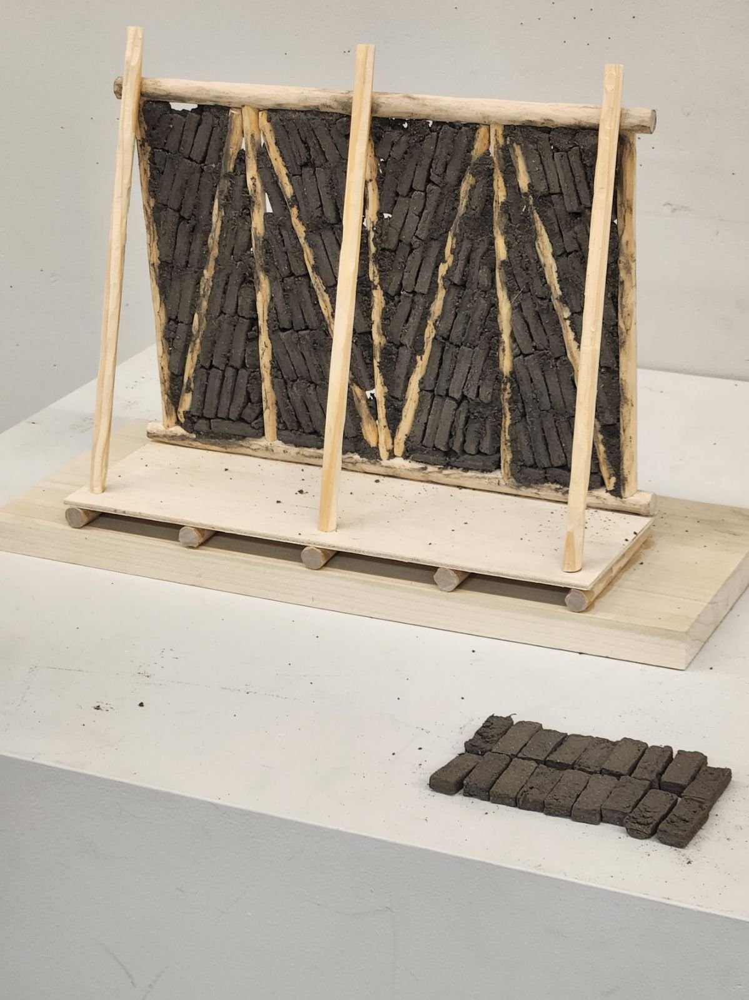
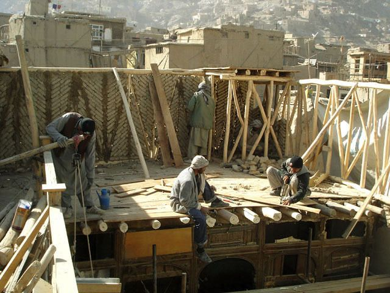
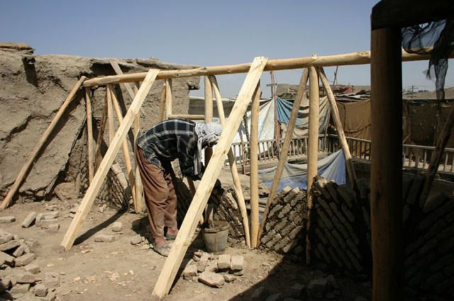
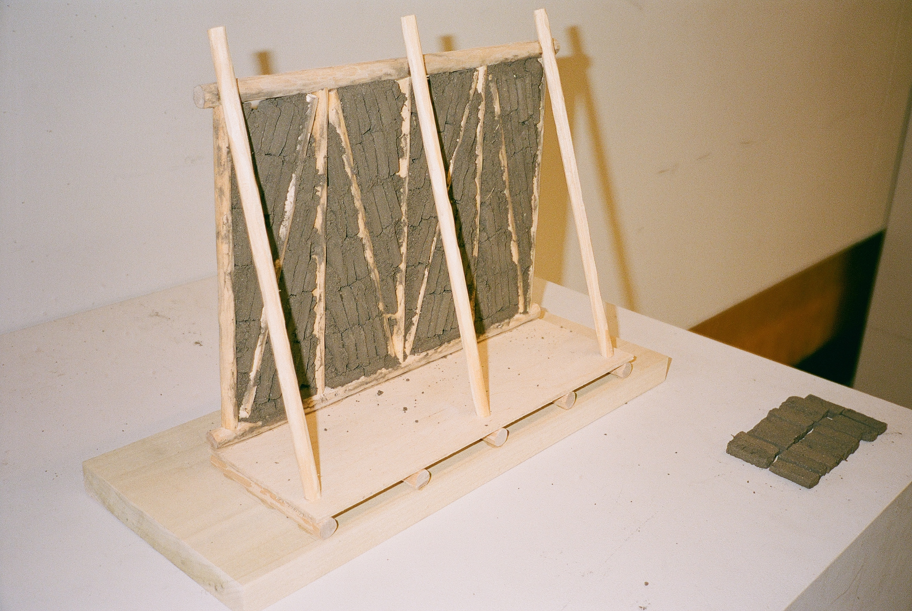
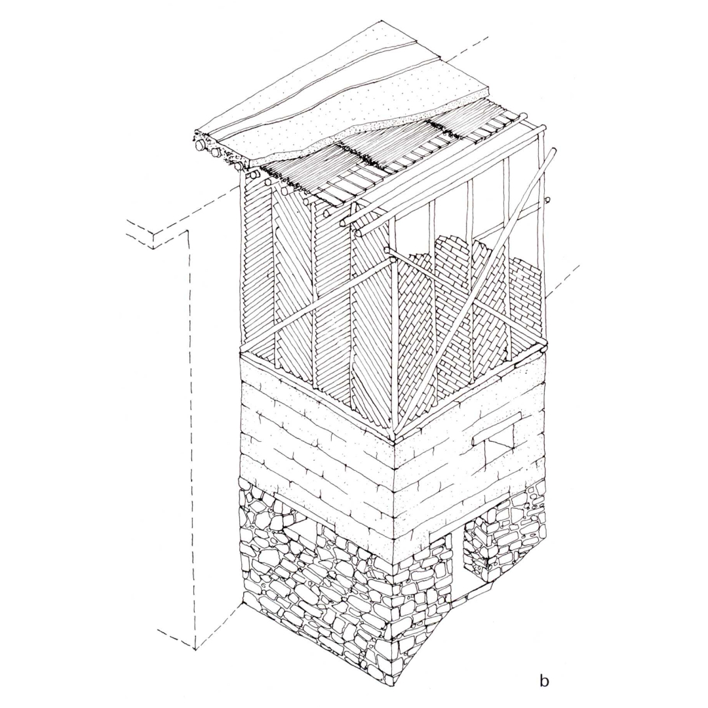
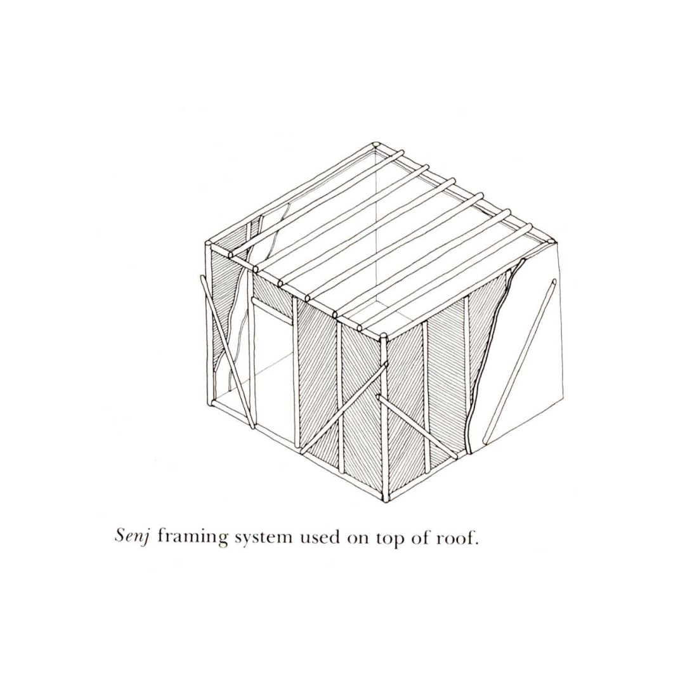
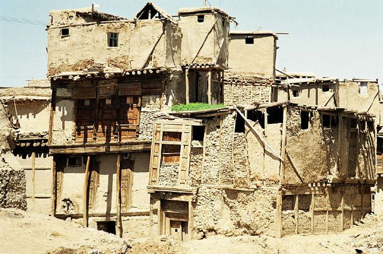
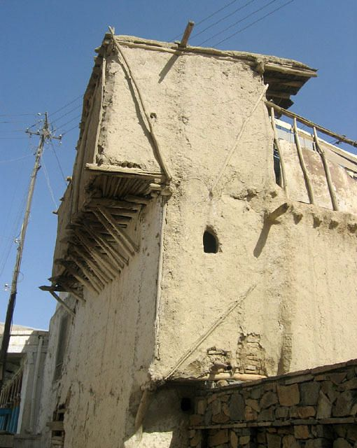
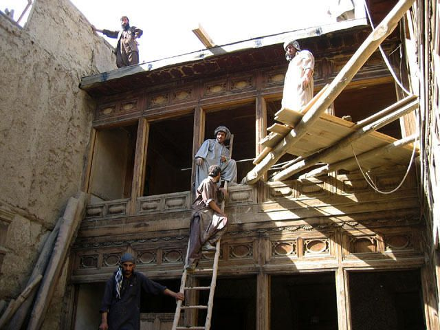

# سنج Senj: Afghan wood framing technology

Senj (سنج) *is a traditional* [Afghan](https://www.archnet.org/sites/5585) wood framing technique. It is a lightweight, flexible, and modular system designed to be placed on upper levels of structures within earthquake prone regions of Afghanistan[^1].

[^1]: My reference.

The[^2] frame is constructed with poplar poles on a flat surface and is joined together to create square or rectangular walls. The horizontal poles are around 15-20cm in diameter, and the vertical/diagonal poles around 10-15cm. They are joined by mortise and tenon about 1m apart, where they are then filled with sun-dried bricks, placed at a diagonal relationship between the vertical and diagonal poles.
[^2]: My reference https://www.archnet.org/sites/5585.

The infilled brick frames are then plastered with a mud and straw mixture on both the interior and the exterior facades. It seems that over time, however, the diagonal poles have been integrated into the complete frame, plastered over and completely hidden. Notice this drawing:

The diagonal bracing pole is left exposed outside of the plaster, as seen in these photos:

Here on the left side wall, all poles have been plastered over and no remnants of the structure are exposed. Could the strength have increased by having the diagonals be integrated into the frame, rather than existing on the exterior of it?

### Model

![Senj Drawing by Omar Mohammad[^3]](../images/work/senj/senj_drawing.jpg)

[^3]: My drawing.

Thank you so much to Professor Ronald Rael for opening the doors of knowledge, wisdom, research and discovery of ancestral design within the context of Architecture at UC Berkeley.

**Omar Mohammad\
Berkeley\
December 2025**

---
` `